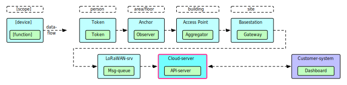
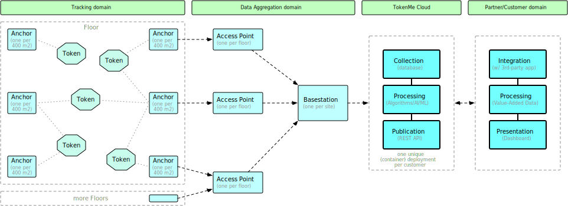
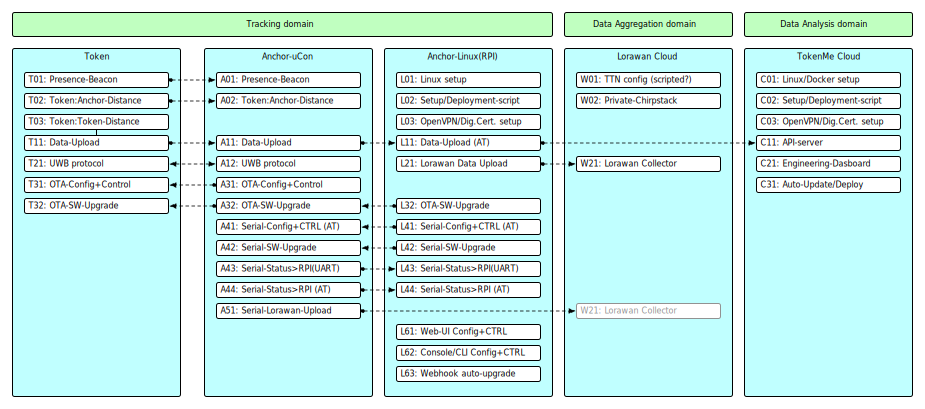
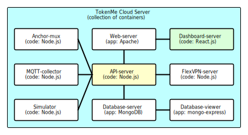

<!-- # 10-system.md -->

# System Design

## Data Flow

  
View image in separate window: <a href="./img/Sostark-TokenMe-dataflow-v1.0.svg" target="_blank">Sostark-TokenMe-dataflow-v1.0.svg</a>

## High-Level Design

 
View image in separate window: <a href="./img/d220125-JDG-TokenMe--Cloud-design-v1.1.svg" target="_blank">d220125-JDG-TokenMe--Cloud-design-v1.1.svg</a>

## Feature Specification

 
View image in separate window: <a href="./img/TokenMe-Architecture--Feature-Spec-v1.1.svg" target="_blank">TokenMe-Architecture--Feature-Spec-v1.1.svg</a>

## Cloud Deployment Design

Definition:  
A Cloud Deployment is:
<ul>
<li>a specific set of applications, with</li>
<li>a common purpose (specific customer/project, and specific DTAP-phase), with</li>
<li>one common configuration file (Name, Dashboard URL, API URL, etc.), with</li>
<li>a unique database (holding only TTL data for this purspose), and</li>
<li>that is started and stopped as a collective unit.</li>
</ul>

This diagram specifies all possible application that could be part of a single Cloud-Deployment:

Note that each application within a cloud-deployment could be running:
<ul>
<li>as a Native-Script: a (start) script that runs directly on the Linux CLI, or</li>
<li>as a Container: a Docker Container Image that is build using a build-script and pushed (stored) in a central Container-Image-Repository, and then pulled (download/create-instance) from that repo to then run as a Docker Container.</li>
</ul>

Typically "D" (Development phase) cloud-deployments run as Native-scripts, and "T" (Testing) and "P" (Production) cloud-deployments run as Containers.

To elaborate, here is what is running now at TokenMe, with the cloud-deployment name structured as Projectname--DTAP-Phase--Deploy-ID
<ul>
<li>`TokenMe-Development-D50` (only running when John is developing)</li>
<li>`TokenMe-Engineering-T51` (the original v1 dashboard)</li>
<li>`TokenMe-Engineering-T52` (the v2 dashboard, but dedicated for internal-Engineering)</li>
<li>`WTC-ND-Engineering-T57` (the v2 dashboard, dedicated for external engineering in WTC-ND project</li>
<li>`THT-Project-P58` (specific instance for the THT Test/Proof-of-Concept project)</li>
<li>`MCS-Demo-D10` (the Mobile-Cloud-Server hw-kit-0 on RPI4, for dev/test by John)</li>
<li>`MCS-Demo-P11` (the Mobile-Cloud-Server hw-kit-1 on RPI4, complete functional mobile kit for demo purposes)</li>
<li>`MCS-Demo-P12` (the Mobile-Cloud-Server hw-kit-2 on RPI4, complete functional mobile kit for demo purposes)</li>
</ul>

