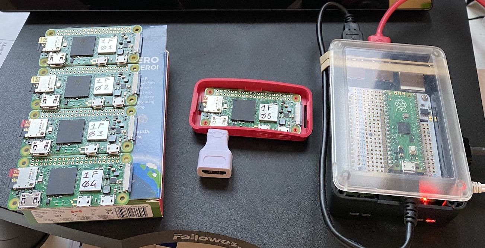
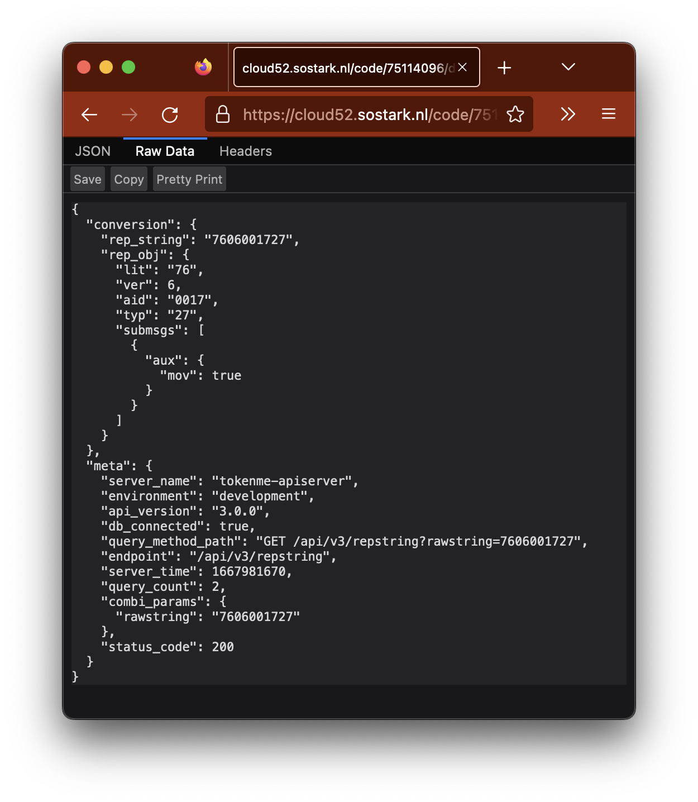

<!-- # 11-data.md -->

# Data Design

## Identifier ID Design

Each component has its own ID, and some are used in Messages or Protocols:

| Label                            | Name      | Size         | Description                                                                                                     |
| -------------------------------- | --------- | ------------ | --------------------------------------------------------------------------------------------------------------- |
| <span class="mono">sys_id</span> | System-ID | 1 or 2 bytes | A Unique Serial Number for a TCS or WiFi-Anchor, used both in Hostname, IP-address and SSL-Certificate          |
| <span class="mono">anc_id</span> | Anchor-ID | 2 byte       | The ID of an Anchor (seperate ID, not derived from mod_id, mac_id or dev_id)                                    |
| <span class="mono">tok_id</span> | Token-ID  | 1 or 2 bytes | The ID as provided by a SUM-module in a Token                                                                   |
| <span class="mono">mod_id</span> | Module-ID | 2 byte       | The ID as provided by a SUM-module in an Anchor                                                                 |
| <span class="mono">mac_id</span> | MAC-ID    | 6 byte       | The MAC (EUI-48) Hardware Address of the WiFi-adapter on the Linux board (e.g. <span class="mono">wlan0</span>) |
| <span class="mono">dev_id</span> | Device-ID | 8 byte       | The DevEUI (EUI-64) hardware address of the LoraWAN-node                                                        |

Note: that all these ID's are represented in the API as capital letters hex-string [0-9A-F] (not as a binary byte), eg sys_id="1F09" is a 4-character string (while the 2-byte integer 1f09 is the decimal number 7945).

Photo of prototype Combi-Anchors with System-ID <span class="mono">1f01</span> to <span class="mono">1f05</span>:



Examples how System-ID is used:

| LID                            | Type  | Hostname                                                 | VPN-Certificate (CommonName)                               | VPN-IP-address                        |
| ------------------------------ | ----- | -------------------------------------------------------- | ---------------------------------------------------------- | ------------------------------------- |
| <span class="mono">1e01</span> | WiFi  | <span class="mono">tokenme-anchor-1e01.sostark.nl</span> | <span class="mono">tokenme-anchor-1e01.vpnsostarknl</span> | <span class="mono">10.212.30.1</span> |
| <span class="mono">1e02</span> | WiFi  | <span class="mono">tokenme-anchor-1e02.sostark.nl</span> | <span class="mono">tokenme-anchor-1e02.vpnsostarknl</span> | <span class="mono">10.212.30.2</span> |
| <span class="mono">1e03</span> | WiFi  | <span class="mono">tokenme-anchor-1e03.sostark.nl</span> | <span class="mono">tokenme-anchor-1e03.vpnsostarknl</span> | <span class="mono">10.212.30.3</span> |
| <span class="mono">1e04</span> | WiFi  | <span class="mono">tokenme-anchor-1e04.sostark.nl</span> | <span class="mono">tokenme-anchor-1e04.vpnsostarknl</span> | <span class="mono">10.212.30.4</span> |
| <span class="mono">1e05</span> | WiFi  | <span class="mono">tokenme-anchor-1e05.sostark.nl</span> | <span class="mono">tokenme-anchor-1e05.vpnsostarknl</span> | <span class="mono">10.212.30.5</span> |
| <span class="mono">1f01</span> | Combi | <span class="mono">tokenme-anchor-1f01.sostark.nl</span> | <span class="mono">tokenme-anchor-1f01.vpnsostarknl</span> | <span class="mono">10.212.31.1</span> |
| <span class="mono">1f02</span> | Combi | <span class="mono">tokenme-anchor-1f02.sostark.nl</span> | <span class="mono">tokenme-anchor-1f02.vpnsostarknl</span> | <span class="mono">10.212.31.2</span> |
| <span class="mono">1f03</span> | Combi | <span class="mono">tokenme-anchor-1f03.sostark.nl</span> | <span class="mono">tokenme-anchor-1f03.vpnsostarknl</span> | <span class="mono">10.212.31.3</span> |
| <span class="mono">1f04</span> | Combi | <span class="mono">tokenme-anchor-1f04.sostark.nl</span> | <span class="mono">tokenme-anchor-1f04.vpnsostarknl</span> | <span class="mono">10.212.31.4</span> |
| <span class="mono">1f05</span> | Combi | <span class="mono">tokenme-anchor-1f05.sostark.nl</span> | <span class="mono">tokenme-anchor-1f05.vpnsostarknl</span> | <span class="mono">10.212.31.5</span> |

## Token and Anchor Groups

- both Token's (`tok_id`) and Anchors (`anc_id`) can be part of a group (`tgroup` and `agroup` respectively)
- groups can be nested: tgroup['team-A'] and tgroup['team-B'] can be part of tgroup['workers']
- a group can be a mix of single items and other groups

## Anchor Token Communication Protocol

Document prepared on 2022-jan-06 by: Peter Knaven <br>
Download: [anchor_token_communication_protocol.pdf](files/anchor_token_communication_protocol.pdf)

## Time Design

- a TCS server (instance) is assumed to be operating in a single `Time-Zone` (such as CET, GMT, etc.), meaning all Anchor report data (holding Token and sensor data), and the API/Web-dashboard data is assumed to be expressed in the same time zone
- all internal time representations (at DB-level and API-level) are expressed in: Unix-Time (seconds since Unix-epoch), which itself is using UTC (UTC+0, so no add/substract of Time-Zone offset)
- to convert a "time-number" as a "time-string", or to decode/parse a "time-string" into a "time-number", the `tcs_time_zone` parameter from the global configuration is used
- Example for tcs_time_zone = `UTC+2`: time-number = `1666908000`, time-string = `2022-10-28 00:00:00`

## Anchor Report serial-string

- The WiFi-Anchors are Linux-based systems (like RPI, Raspberry Pi), with a serial-connection (RS232, usually with semi-TTL voltages of 3.3V) to a SUM4 uCon (microcontroller).
- This serial connection has settings: 115200 baud, 8N1, no-handshake
- On this connection there are several string-formats defined, called <span class="mono">Anchor-Report Serial-String</span> or <span class="mono">Anchor-String</span> versions, or shorter: <span class="mono">REPSTRING</span> (for Report String)

### Common REPSTRING specifications

- REPSTRING only uses lower-case <span class="mono">alphanumerical</span> characters (regex: `/[a-z0-9]+/`)
- REPSTRING uses a specific subset of delimiter-characters, regex: `/[\.,\:\;\-\|]+/`)
- REPSTRING uses only numbers or identifiers in lower-case <span class="mono">hexadecimal</span> format (not in decimal format)
- REPSTRING uses a specific number of fields with specific meaning (defined in the version-spec), and all fields are an integer number of bytes wide (1,2,3,4,etc.) (no half-bytes, or bits)

### REPSTRING v01 spec

This is the original Wifi-Anchor string version.

```js
{ "version" : "v01",
  "example" : "0533 09 6079eea5 07 3e 47 00 00",
  "fields" : [
    { "seq"  : { "description" : "sequence"        , "size_bytes": 2, "data" : "0533"     } },
    { "aid"  : { "description" : "anchor-id"       , "size_bytes": 1, "data" : "09"       } },
    { "time" : { "description" : "time-epoch"      , "size_bytes": 4, "data" : "6079eea5" } },
    { "tid1" : { "description" : "token-id(1)"     , "size_bytes": 1, "data" : "07"       } },
    { "tid2" : { "description" : "token-id(2)"     , "size_bytes": 1, "data" : "3e"       } },
    { "tid3" : { "description" : "token-id(3)"     , "size_bytes": 1, "data" : "47"       } },
    { "tid4" : { "description" : "token-id(4)"     , "size_bytes": 1, "data" : "00"       } },
    { "tid5" : { "description" : "token-id(5)"     , "size_bytes": 1, "data" : "00"       } },
  ]
}
```

### REPSTRING v02 spec

This is the first Wifi-Anchor string version, that carries extra token-data (battery level, etc.).

```js
{ "version" : "v02",
  "example" : "0481 41 6079e77b 42 01 01 01 48 02 02 02 00 03 03 03 00 04 04 04 00 05 05 05",
  "fields" : [
    { "seq"  : { "description" : "sequence"        , "size_bytes": 2, "data" : "0481"     } },
    { "aid"  : { "description" : "anchor-id"       , "size_bytes": 1, "data" : "41"       } },
    { "time" : { "description" : "time-epoch"      , "size_bytes": 4, "data" : "6079e77b" } },
    { "tid1" : { "description" : "token-id(1)"     , "size_bytes": 1, "data" : "42"       } },
    { "bpl1" : { "description" : "tid(1)-Battery"  , "size_bytes": 1, "data" : "01"       } },
    { "rsi1" : { "description" : "tid(1)-rssi"     , "size_bytes": 1, "data" : "01"       } },
    { "mis1" : { "description" : "tid(1)-missed"   , "size_bytes": 1, "data" : "01"       } },
    { "tid2" : { "description" : "token-id(2)"     , "size_bytes": 1, "data" : "48"       } },
    { "bpl2" : { "description" : "tid(2)-Battery"  , "size_bytes": 1, "data" : "02"       } },
    { "rsi2" : { "description" : "tid(2)-rssi"     , "size_bytes": 1, "data" : "02"       } },
    { "mis2" : { "description" : "tid(2)-missed"   , "size_bytes": 1, "data" : "02"       } },
    { "tid3" : { "description" : "token-id(3)"     , "size_bytes": 1, "data" : "00"       } },
    { "bpl3" : { "description" : "tid(3)-Battery"  , "size_bytes": 1, "data" : "03"       } },
    { "rsi3" : { "description" : "tid(3)-rssi"     , "size_bytes": 1, "data" : "03"       } },
    { "mis3" : { "description" : "tid(3)-missed"   , "size_bytes": 1, "data" : "03"       } },
    { "tid4" : { "description" : "token-id(4)"     , "size_bytes": 1, "data" : "00"       } },
    { "bpl4" : { "description" : "tid(4)-Battery"  , "size_bytes": 1, "data" : "04"       } },
    { "rsi4" : { "description" : "tid(4)-rssi"     , "size_bytes": 1, "data" : "04"       } },
    { "mis4" : { "description" : "tid(4)-missed"   , "size_bytes": 1, "data" : "04"       } },
    { "tid5" : { "description" : "token-id(5)"     , "size_bytes": 1, "data" : "00"       } },
    { "bpl5" : { "description" : "tid(5)-Battery"  , "size_bytes": 1, "data" : "05"       } },
    { "rsi5" : { "description" : "tid(5)-rssi"     , "size_bytes": 1, "data" : "05"       } },
    { "mis5" : { "description" : "tid(5)-missed"   , "size_bytes": 1, "data" : "05"       } }
  ]
}

```

### REPSTRING v03 spec

This is a copy of "Wifi-Anchor string v2" but with the space as delimiter replaced by ":" (colon) as major-delimiter, and "," (comma) as minor-delimiter.

```js
{ "version" : "v03",
  "example" : "0481:41:6079e77b:42,01,01,01:48,02,02,02:00,03,03,03:00,04,04,04:00,05,05,05",
  "fields" : [
    { "seq"  : { "description" : "sequence"        , "size_bytes": 2, "data" : "0481"     } },
    { "aid"  : { "description" : "anchor-id"       , "size_bytes": 1, "data" : "41"       } },
    { "time" : { "description" : "time-epoch"      , "size_bytes": 4, "data" : "6079e77b" } },
    { "tid1" : { "description" : "token-id(1)"     , "size_bytes": 1, "data" : "42"       } },
    { "bpl1" : { "description" : "tid(1)-Battery"  , "size_bytes": 1, "data" : "01"       } },
    { "rsi1" : { "description" : "tid(1)-rssi"     , "size_bytes": 1, "data" : "01"       } },
    { "mis1" : { "description" : "tid(1)-missed"   , "size_bytes": 1, "data" : "01"       } },
    { "tid2" : { "description" : "token-id(2)"     , "size_bytes": 1, "data" : "48"       } },
    { "bpl2" : { "description" : "tid(2)-Battery"  , "size_bytes": 1, "data" : "02"       } },
    { "rsi2" : { "description" : "tid(2)-rssi"     , "size_bytes": 1, "data" : "02"       } },
    { "mis2" : { "description" : "tid(2)-missed"   , "size_bytes": 1, "data" : "02"       } },
    { "tid3" : { "description" : "token-id(3)"     , "size_bytes": 1, "data" : "00"       } },
    { "bpl3" : { "description" : "tid(3)-Battery"  , "size_bytes": 1, "data" : "03"       } },
    { "rsi3" : { "description" : "tid(3)-rssi"     , "size_bytes": 1, "data" : "03"       } },
    { "mis3" : { "description" : "tid(3)-missed"   , "size_bytes": 1, "data" : "03"       } },
    { "tid4" : { "description" : "token-id(4)"     , "size_bytes": 1, "data" : "00"       } },
    { "bpl4" : { "description" : "tid(4)-Battery"  , "size_bytes": 1, "data" : "04"       } },
    { "rsi4" : { "description" : "tid(4)-rssi"     , "size_bytes": 1, "data" : "04"       } },
    { "mis4" : { "description" : "tid(4)-missed"   , "size_bytes": 1, "data" : "04"       } },
    { "tid5" : { "description" : "token-id(5)"     , "size_bytes": 1, "data" : "00"       } },
    { "bpl5" : { "description" : "tid(5)-Battery"  , "size_bytes": 1, "data" : "05"       } },
    { "rsi5" : { "description" : "tid(5)-rssi"     , "size_bytes": 1, "data" : "05"       } },
    { "mis5" : { "description" : "tid(5)-missed"   , "size_bytes": 1, "data" : "05"       } }
  ]
}
```

### REPSTRING v04 spec

This is the first version of the Lorawan-Anchor string (optimized for space).

```js
{ "version" : "v04",
  "example" : "5d960061401b0000000000000000",
  "fields" : [
    { "seq"  : { "description" : "sequence"        , "size_bytes": 2, "data" : "5d96"     } },
    { "aid"  : { "description" : "anchor-id"       , "size_bytes": 2, "data" : "0061"     } },
    { "tid1" : { "description" : "token-id(1)"     , "size_bytes": 1, "data" : "40"       } },
    { "seq1" : { "description" : "tid(1)-sequence" , "size_bytes": 1, "data" : "1b"       } },
    { "tid2" : { "description" : "token-id(2)"     , "size_bytes": 1, "data" : "40"       } },
    { "seq2" : { "description" : "tid(2)-sequence" , "size_bytes": 1, "data" : "00"       } },
    { "tid3" : { "description" : "token-id(3)"     , "size_bytes": 1, "data" : "00"       } },
    { "seq3" : { "description" : "tid(3)-sequence" , "size_bytes": 1, "data" : "00"       } },
    { "tid4" : { "description" : "token-id(4)"     , "size_bytes": 1, "data" : "00"       } },
    { "seq4" : { "description" : "tid(4)-sequence" , "size_bytes": 1, "data" : "00"       } },
    { "tid5" : { "description" : "token-id(5)"     , "size_bytes": 1, "data" : "00"       } },
    { "seq5" : { "description" : "tid(5)-sequence" , "size_bytes": 1, "data" : "00"       } }
  ]
}
```

### REPSTRING v05 spec

- a version-tag as <span class="mono">prefix</span>: `v05`
- a trailing EOL (End of Line) delimiter as <span class="mono">postfix</span>: `.`
- a variable number (0 to 15) of <span class="mono">sub-messages</span> can be present, where each sub-message represents some data about one (1) token, and the sub-message-fields are seperated by a "," (comma) as minor-delimiter (the sub-messages themselves are seperated by a ":" (colon) as major-delimiter)
- <span class="red">all</span> fields have a (unique) field-prefix, for example `s` in the sequence-data `:s0481:`
- after the repstring (but before the EOL!) an optional `|` pipe-character can be placed, after which any debug data can be send (which will be ignored by the Cloud Repstring parsing, but this debug-field will be saved as-is in the cloud-database)

#### V05 WIFI formatted message

```js
{ "version" : "v05",
  "example" : "v05:s0481:a41:e6079e77b:t42,b01,r01,m01:t48,b02,r02,m02:t49,b03,r03,m03.",
  "example2": "v05:s0481:a41:e6079e77b:t42,b01,r01,m01|some-debug-data-here.",
  "fields" : [
    { "ver"  : { "description" : "REPSTR.-version" , "prefix": "v", "size_bytes": 1, "data" : "05"       } },
    { "seq"  : { "description" : "sequence"        , "prefix": "s", "size_bytes": 2, "data" : "0481"     } },
    { "aid"  : { "description" : "anchor-id"       , "prefix": "a", "size_bytes": 1, "data" : "41"       } },
    { "time" : { "description" : "time-epoch"      , "prefix": "e", "size_bytes": 4, "data" : "6079e77b" } },
    // <start-sub-message for message type 1>  -- can be inserted 0 to 15 times:
    { "tid1" : { "description" : "token-id(1)"     , "prefix": "v", "size_bytes": 1, "data" : "42"       } },
    { "bpl1" : { "description" : "tid(1)-Battery"  , "prefix": "b", "size_bytes": 1, "data" : "01"       } },
    { "rsi1" : { "description" : "tid(1)-rssi"     , "prefix": "r", "size_bytes": 1, "data" : "01"       } },
    { "mis1" : { "description" : "tid(1)-missed"   , "prefix": "m", "size_bytes": 1, "data" : "01"       } },

    { "tid2" : { "description" : "token-id(2)"     , "prefix": "t", "size_bytes": 1, "data" : "48"       } },
    { "bpl2" : { "description" : "tid(2)-Battery"  , "prefix": "b", "size_bytes": 1, "data" : "02"       } },
    { "rsi2" : { "description" : "tid(2)-rssi"     , "prefix": "r", "size_bytes": 1, "data" : "02"       } },
    { "mis2" : { "description" : "tid(2)-missed"   , "prefix": "m", "size_bytes": 1, "data" : "02"       } },

    { "tid3" : { "description" : "token-id(3)"     , "prefix": "t", "size_bytes": 1, "data" : "49"       } },
    { "bpl3" : { "description" : "tid(3)-Battery"  , "prefix": "b", "size_bytes": 1, "data" : "03"       } },
    { "rsi3" : { "description" : "tid(3)-rssi"     , "prefix": "r", "size_bytes": 1, "data" : "03"       } },
    { "mis3" : { "description" : "tid(3)-missed"   , "prefix": "m", "size_bytes": 1, "data" : "03"       } },
    // </end-sub-message>
  ]
}
```

#### New definition method REPSTRING-V05

```js
const repstring_definition_v5 = {
  version: 5,
  msg_format: {
    fields: [
      {
        name: "lit",
        descr: "Anchor_msg Start of Frame",
        length: 1,
        type: "literal",
        value: "76",
      },
      {
        name: "ver",
        descr: "Anchor_msg version",
        length: 1,
        type: "unsigned",
      },
      {
        name: "aid",
        descr: "Anchor_ID",
        length: 2,
        type: "unsigned",
      },
    ],
  },
  min_nr_submsg: 1,
  max_nr_submsg: 40,
  field_defs: {
    tid_1b: {
      name: "tid",
      descr: "Token_ID",
      length: 1,
      type: "unsigned",
    },
    bat: {
      name: "bat",
      descr: "Battery level",
      length: 1,
      type: "unsigned",
      unit: "volt",
      percent_of_ref: 3.3,
    },
  },
  submsg_format: [
    {
      fields: [{ field_def: "tid_1b" }, { field_def: "bat" }],
    },
  ],
};
```

### REPSTRING v06 spec

- this version 6 of the REPSTRING (report-serial-string) is an advancement from the v5, with the addition (or change) of these token-fields
  - <span class="mono">Distance</span> <br> the measured distance between a Token and an Anchor is represented in 1-decimeter (10-cm) units, and coded in 1-byte (2-hexchars), providing a range of "00"-"FF" = 0 - 25,5 meters, with "00" meaning: there was no distance measurement for this token, so this Token is "located" only as begin in-range "presence" of this Anchor.
- the <span class="mono">Anchor-ID</span> is increased to (fixed) <span class="mono">2-bytes</span> (4-hexchars)

#### V06 WIFI formatted message

```js
{ "version" : "v06",
  "example" : "v06:s0481:a1a41:e6079e77b:t42,b01,r01,q45,da2.",
  "example2": "v06:s0481:a1a41:e6079e77b:t42,b01,r01,q45,da2|some-debug-data-here.",
  "example3": "v06:s0481:a1a41:e6079e77b:t42,b01,r01,q45,da2:t1048,b01,r01,q45,da2:t2049,b01,r01,q45,da2.",
  "fields" : [
    { "ver"  : { "description" : "REPSTR.-version" , "prefix": "v", "size_bytes": 1, "data" : "06"       } },
    { "seq"  : { "description" : "sequence"        , "prefix": "s", "size_bytes": 2, "data" : "0481"     } },
    { "aid"  : { "description" : "anchor-id"       , "prefix": "a", "size_bytes": 2, "data" : "1a41"     } },
    { "time" : { "description" : "time-epoch"      , "prefix": "e", "size_bytes": 4, "data" : "6079e77b" } },
    // <start-sub-message>  -- can be inserted 0 to 15 times:
    { "tid"  : { "description" : "token-id"        , "prefix": "t", "size_bytes": 1, "data" : "42"       } },  // size can be 1 or 2 for Token-ID
    { "bpl"  : { "description" : "tid-Battery"     , "prefix": "b", "size_bytes": 1, "data" : "01"       } },
    { "rsi"  : { "description" : "tid-rssi"        , "prefix": "r", "size_bytes": 1, "data" : "01"       } },
    { "tsq"  : { "description" : "tid-sequence"    , "prefix": "q", "size_bytes": 1, "data" : "45"       } },
    { "dst"  : { "description" : "tid-distance"    , "prefix": "d", "size_bytes": 1, "data" : "a2"       } }

    { "tid"  : { "description" : "token-id"        , "prefix": "t", "size_bytes": 1, "data" : "1048"     } },  // size can be 1 or 2 for Token-ID
    { "bpl"  : { "description" : "tid-Battery"     , "prefix": "b", "size_bytes": 1, "data" : "01"       } },
    { "rsi"  : { "description" : "tid-rssi"        , "prefix": "r", "size_bytes": 1, "data" : "01"       } },
    { "tsq"  : { "description" : "tid-sequence"    , "prefix": "q", "size_bytes": 1, "data" : "45"       } },
    { "dst"  : { "description" : "tid-distance"    , "prefix": "d", "size_bytes": 1, "data" : "a2"       } }

    { "tid"  : { "description" : "token-id"        , "prefix": "t", "size_bytes": 1, "data" : "2049"     } },  // size can be 1 or 2 for Token-ID
    { "bpl"  : { "description" : "tid-Battery"     , "prefix": "b", "size_bytes": 1, "data" : "01"       } },
    { "rsi"  : { "description" : "tid-rssi"        , "prefix": "r", "size_bytes": 1, "data" : "01"       } },
    { "tsq"  : { "description" : "tid-sequence"    , "prefix": "q", "size_bytes": 1, "data" : "45"       } },
    { "dst"  : { "description" : "tid-distance"    , "prefix": "d", "size_bytes": 1, "data" : "a2"       } }
    // </end-sub-message>
  ]
}
```

#### V06 Lorawan-Anchor string (optimized for space)

UPLINK MESSAGES (towards the cloud)

- the message type covers the entire message, so no mixed reporting of distance and battery levels
- created message type that reports token ids with rssi (signed byte)
- created message type that reports token ids with age related information (seconds ago)
- created message type that only reports token ids (in case of overload of tokens at an anchor)
- repeated message types for 2 byte tokenid
- adoption of V5 feature specification for Lora as well, i.e. the variable number submessages and (very limited) debug data to follow
- created message type that reports sensor data
  temp DEGREE C [Q = 256],
  humidity % [Q = 256]
  pressure hPa. [Q = 256] + 1000]
  mox kOHM [Q = 256]
  altitude METERS [Q = 256]
  Q256 (official is Q16) to express a float into a 2 byte value within a margin of error
  multiply by 256 before sending Qvalue
  divide Qvalue by 256 to get the original number back
  A iteration counter is used , that isncremented on each new reading [will wrap]
  Checksum : Add all bytes including CSUM BUT EXCLUDE SOF.
  Accumulator is 8bit UNSIGNED ….. Ignore any overflow
  If all correct Result should == 0
- created message type that reports motion detected by anchor
- created message type that reports alarm (fall detect) reported by tokens
- created message type that reports battery level on anchor
- created message type that reports temperature in Celsius on anchor
- created message type that reports activity on anchor
     wakeup code:1  RTC timer wakeup
     wakeup code:2  accelerometer movement wakeup
     wakeup code:4  NFC tag read wakeup
     wakeup code:8  PIR movement wakeup
   nr of presence messages that are sent since wakeup
   nr of PIR movements detected messages since wakeup
- created message type that reports movement detected by PIR (infrared motion detector)
- created message type that reports version information and wakeup information when anchor firmware starts
- created message type that reports token differences since the last report
- created message type that reports tokens with time-slot-indication since the last report
- created message type with revolving 16-bit RTC timestamp that reports tokens with time-slot-indication since the last report
     timeslot indication is 8-bit value where every bit represents a time-slot (1 sec for instance) within the reporting period (7 sec for instance)
     the oldest time is indicated in the MSB bit, so
        0x07 indicates that only during the last 3 time slots the presence was detected, suggesting arrival of token at anchor 
        0xF0 indicates that only during the first 4 time slots the presence was detected, suggesting departure of token at anchor
- created message type that reports tokens that haven't been detect since the last report (indicating removal)
- created message type with revolving 16-bit RTC timestamp reports tokens that haven't been detect since the last report (indicating removal)
- created message type that reports mix of present and absent tokens
#### 24 July 2023
- created message type that reports anchor shutdown for x minutes
- created message type for alarm with following alarm codes
  	alarm code 1,   fall detect
  	alarm code 2,   fall cancel
- created message type to report notifications from one or more tokens
      
DOWNLINK MESSAGES (from dashboard to Lora end device on anchors)
  Downlink messages are sent to anchors. Anchor ids can either be individually specified or 0xFFFF can be used as anchor id
  to indicate all anchors connected to Lora gateway(s)
 
- created message type to halt and or reset anchor(s)
- created message type to set date and time (local timezone) for anchor(s) (minute accuracy)
- created message type to send configuration data for anchor(s) 
- created message type to request sensor data from anchor(s) 
- created message type to request to request anchor batter and temperature from anchor
- created message type to request version information from anchor
- and more (see examples below)

```js
{ "version"  : "v06",
  "example"  : "7606:0061:01:40,1b.",
  "example"  : "7606:0061:01:40,1b|some-debug-data-here.",
  "example"  : "7606:0061:02:40,30:3a,34.",
  "example"  : "7606:0061:02:40,30:3a,34|some-debug-data-here.",
  "example"  : "7606:0061:03:40,30:3a,34.",
  "example"  : "7606:0061:04:40,c4:3a,2a.",
  "example"  : "7606:0061:05:40:3a:6b.",

  "example"  : "7606:0061:21:0340,1b.",                       // tokenids with battery percentage level
  "example"  : "7606:0061:21:0340,1b|some-debug-data-here.",  // tokenids with battery percentage level and debug data
  "example"  : "7606:0061:22:0340,30:4a3a,34.",               // tokenids with distance 
  "example"  : "7606:0061:23:0340,c4:4a3a,2a.",               // tokenids with rssi
  "example"  : "7606:0061:24:0340,1a:4a3a,40.",               // tokenids with age
  "example"  : "7606:0061:25:0340:4a3a:006b.",                // tokenids only
  "example"  : "7606:0061:26:FA0D20452BB7090A12AB2BC86584.",  // sensor information straight passed through
  "example"  : "7606:0061:27.",                               // anchor id is moving
  "example"  : "7606:0061:28:0340.",                          // token id(s) that report fall detected
  "example"  : "7606:0061:29:1b.",                            // battery level anchor
  "example"  : "7606:0061:2a:20.",                            // anchor temperature  (a nice 32 Celsius)
  "example"  : "7606:0061:2b:01:0024:0006."                   // activity anchor (wakeupCode, #presence msgs, #PIR movements) 
  "example"  : "7606:0061:2c."                                // PIR motion detect by anchor
  "example"  : "7606:0061:2d:1903:01."                        // Anchor firmware version 0x1903, anchor wakeup is caused by RTC
  "example"  : "7606:0061:2e:02:0345:1122:3032."              // tokenids with that are new / removed since the last time
                                                              // the number of newly discovered 2 are mentioned in the message, 
                                                              // the remainder of token ids are "removed" tokens
  "example"  : "7606:0061:2f:0345,07:1122,F8:3032,5A."        // tokenids with time-slot-indication of presence detection
  "example"  : "7606:0061:30:782F:0345,07:1122,F8:3032,5A."   // 16-bit revolving RTC timestamp and tokenids with timeslot-indication of presence
  "example"  : "7606:0061:31:0348:1122:3032."                 // tokenids that haven't been detected during this entire cycle
  "example"  : "7606:0061:32:782F:0348:1022:0032."            // 16-bit revolving RTC timestamp and tokenids that haven't been detected during cycle
  "example"  : "7606:0061:33:01:0345:1122:3022."              // mix of present and absent tokens since last report cycle
  "example"  : "7606:0061:34:4b:20::FA0D20452BB7090A12AB2BC86584." // bat 75%, temp (32Celsius) and sensor information straight passed through
  "example"  : "7606:0061:35:09:0A:02:0384:001c:02:01:01:01:00." // lora configuration data
#### 24 July 2023
  "example"  : "7606:0061:36:0064."                           // anchor indicating it will shutdown for 0x64=(100) minutes
  "example"  : "7606:0061:37:1302,02:0345,01."                // tokenid 0x1302 that sends out alarm code 2(=fall cancel)
                                                              // and tokenid 0x345 that sends out alarm code 1 (=fall detect)  
  "example"  : "7606:0061:38:1302:0340:0345."                 // tokenid 1302, 0340, 0345 send out notification msg requesting attention
 
   "fields" : [
    { "lit"  : { "description" : "literal v"       , "size_bytes": 1, "data" : "76"       } },
    { "ver"  : { "description" : "REPSTR.-version" , "size_bytes": 1, "data" : "06"       } },
    { "aid"  : { "description" : "anchor-id"       , "size_bytes": 2, "data" : "0061"     } },
    { "typ"  : { "description" : "message type"    , "size_bytes": 1, "data" : "01"       } },
    // <start-sub-message for message type 1>  -- can be inserted 0 to 15 times:
    { "tid1" : { "description" : "token-id"        , "size_bytes": 1, "data" : "40"       } },
    { "bat1" : { "description" : "tid-batlevel"    , "size_bytes": 1, "data" : "1b"       } },
    // <start-sub-message for message type 2>  -- can be inserted 0 to 15 times:
    { "tid1" : { "description" : "token-id"        , "size_bytes": 1, "data" : "40"       } },
    { "seq1" : { "description" : "tid-distance"    , "size_bytes": 1, "data" : "30"       } },
    { "tid2" : { "description" : "token-id"        , "size_bytes": 1, "data" : "3a"       } },
    { "seq2" : { "description" : "tid-distance"    , "size_bytes": 1, "data" : "34"       } },
    // <start-sub-message for message type 3>  -- can be inserted 0 to 15 times:
    { "tid1" : { "description" : "token-id"        , "size_bytes": 1, "data" : "40"       } },
    { "rsi1" : { "description" : "tid-rssi"        , "size_bytes": 1, "data" : "c4"       } },    // rssi -60
    { "tid2" : { "description" : "token-id"        , "size_bytes": 1, "data" : "3a"       } },
    { "rsi2" : { "description" : "tid-rssi"        , "size_bytes": 1, "data" : "2a"       } },    // rssi 42
    // <start-sub-message for message type 4>  -- can be inserted 0 to 15 times:
    { "tid1" : { "description" : "token-id"        , "size_bytes": 1, "data" : "40"       } },
    { "age1" : { "description" : "tid-age"         , "size_bytes": 1, "data" : "1a"       } },    // 26 seconds ago
    { "tid2" : { "description" : "token-id"        , "size_bytes": 1, "data" : "3a"       } },
    { "age2" : { "description" : "tid-age"         , "size_bytes": 1, "data" : "40"       } },    // 64 seconds ago
    // <start-sub-message for message type 5>  -- can be inserted 0 to 30 times:
    { "tid1" : { "description" : "token-id"        , "size_bytes": 1, "data" : "40"       } },
    { "tid2" : { "description" : "token-id"        , "size_bytes": 1, "data" : "3a"       } },
    { "tid3" : { "description" : "token-id"        , "size_bytes": 1, "data" : "6b"       } },

    // now defined for tokenid of 2 bytes
    // <start-sub-message for message type 0x21>  -- can be inserted 0 to 10 times:
    { "tid1" : { "description" : "token-id"        , "size_bytes": 2, "data" : "0340"       } },
    { "seq1" : { "description" : "tid-batlevel"    , "size_bytes": 1, "data" : "1b"       } },
    // <start-sub-message for message type 0x22>  -- can be inserted 0 to 10 times:
    { "tid1" : { "description" : "token-id"        , "size_bytes": 2, "data" : "0340"     } },
    { "dis1" : { "description" : "tid-distance"    , "size_bytes": 1, "data" : "30"       } },
    { "tid2" : { "description" : "token-id"        , "size_bytes": 2, "data" : "4a3a"     } },
    { "dis2" : { "description" : "tid-distance"    , "size_bytes": 1, "data" : "34"       } },
    // <start-sub-message for message type 0x23>  -- can be inserted 0 to 10 times:
    { "tid1" : { "description" : "token-id"        , "size_bytes": 2, "data" : "0340"     } },
    { "rsi1" : { "description" : "tid-rssi"        , "size_bytes": 1, "data" : "c4"       } },    // rssi -60
    { "tid2" : { "description" : "token-id"        , "size_bytes": 2, "data" : "4a3a"     } },
    { "rsi2" : { "description" : "tid-rssi"        , "size_bytes": 1, "data" : "2a"       } },    // rssi 42
    // <start-sub-message for message type 0x24>  -- can be inserted 0 to 10 times:
    { "tid1" : { "description" : "token-id"        , "size_bytes": 2, "data" : "0340"     } },
    { "age1" : { "description" : "tid-age"         , "size_bytes": 1, "data" : "1a"       } },    // 26 seconds ago
    { "tid2" : { "description" : "token-id"        , "size_bytes": 2, "data" : "4a3a"     } },
    { "age2" : { "description" : "tid-age"         , "size_bytes": 1, "data" : "40"       } },    // 64 seconds ago
    // <start-sub-message for message type 0x25>  -- can be inserted 0 to 15 times:
    { "tid1" : { "description" : "token-id"        , "size_bytes": 2, "data" : "0340"     } },
    { "tid2" : { "description" : "token-id"        , "size_bytes": 2, "data" : "4a3a"     } },
    { "tid3" : { "description" : "token-id"        , "size_bytes": 2, "data" : "006b"     } },
    // <start-sub-message for message type 0x26>:
    { "sof" : { "description" : "start-of-frame"   , "size_bytes": 1, "data" : "FA"       } },
    { "len" : { "description" : "length-of-data"   , "size_bytes": 1, "data" : "0D"       } },
    { "tmp" : { "description" : "temperature"      , "size_bytes": 2, "data" : "2045"     } },
    { "hum" : { "description" : "humidity"         , "size_bytes": 2, "data" : "2BB7"     } },
    { "pas" : { "description" : "pressure-pascal"  , "size_bytes": 2, "data" : "090A"     } },
    { "mox" : { "description" : "mox"              , "size_bytes": 2, "data" : "12AB"     } },
    { "alt" : { "description" : "altitude"         , "size_bytes": 2, "data" : "2BC8"     } },
    { "itr" : { "description" : "iteration"        , "size_bytes": 1, "data" : "65"       } }, //Incremented on each new reading [will wrap]
    { "cks" : { "description" : "check-sum"        , "size_bytes": 1, "data" : "84"       } },

    // <empty-sub-message for message type 0x27>:
    // <start-sub-message for message type 0x28>  -- can be inserted 0 to 15 times:
    { "tid1" : { "description" : "token-id"        , "size_bytes": 2, "data" : "0340"     } },
    // <start-sub-message for message type 0x29>
    { "bat" : { "description" : "anchor-batlevel"  , "size_bytes": 1, "data" : "1b"     } },
    // <start-sub-message for message type 0x2a>
    { "tmp" : { "description" : "anchor-tmp-int"  , "size_bytes": 1, "data" : "20"     } },
    // <start-sub-message for message type 0x2b>
    { "wco" : { "description" : "wakeup-code"     , "size_bytes": 1, "data" : "01"     } },
    { "nps" : { "description" : "nr-presence-msgs", "size_bytes": 2, "data" : "002e"   } },
    { "npm" : { "description" : "nr-pir-movements", "size_bytes": 2, "data" : "0005"     } },
    // <empty-sub-message for message type 0x2c>
    // <start-sub-message for message type 0x2d>
    { "ver" : { "description" : "version"         , "size_bytes": 2, "data" : "1902"    } },
    { "wku" : { "description" : "wakeup-code",      "size_bytes": 1, "data" : "01"      } },
    // <start-sub-message for message type 0x2e>  -- token ids can be inserted 0 to 14 times  (only for differential reporting!):
    { "new" : { "description" : "nr-new-tokens"    , "size_bytes": 1, "data" : "01"       } },
    { "tid1" : { "description" : "token-id"        , "size_bytes": 2, "data" : "0345"     } },   // newly discovered token id 
    { "tid2" : { "description" : "token-id"        , "size_bytes": 2, "data" : "1122"     } },   // removed token id (not detected since last report)
    { "tid3" : { "description" : "token-id"        , "size_bytes": 2, "data" : "3022"     } },   // removed token id (not detected since last report)

    // <start-sub-message for message type 0x2f>  -- tokenid, time-slot combo can be inserted 0 to 10 times:
    { "tid1" : { "description" : "tokenid"                , "size_bytes": 2, "data" : "0345"     } },
    { "pts1" :  { "description" : "presence-time-slot"    , "size_bytes": 1, "data" : "07"       } },      // token is arriving at anchor
    { "tid2" : { "description" : "tokenid"                , "size_bytes": 2, "data" : "1122"     } },
    { "pts2" :  { "description" : "presence-time-slot"    , "size_bytes": 1, "data" : "F0"       } },      // token is departing from anchor
    { "tid3" : { "description" : "tokenid"                , "size_bytes": 2, "data" : "3032"     } },
    { "pts3" :  { "description" : "presence-time-slot"    , "size_bytes": 1, "data" : "5A"       } },      // token is lingering around 
    // <start-sub-message for message type 0x30>  -- tokenid, time-slot combo can be inserted 0 to 9 times:
    { "smp"  : { "description"  : "rtc-timestamp"         , "size_bytes": 2, "data" : "782f"     } },
    { "tid1" : { "description"  : "token-id"              , "size_bytes": 2, "data" : "0345"     } },
    { "pts1" :  { "description" : "presence-time-slot"    , "size_bytes": 1, "data" : "07"       } },      // token is arriving at anchor
    { "tid2" : { "description" : "tokenid"                , "size_bytes": 2, "data" : "1122"     } },
    { "pts2" :  { "description" : "presence-time-slot"    , "size_bytes": 1, "data" : "F0"       } },      // token is departing from anchor
    { "tid3" : { "description" : "tokenid"                , "size_bytes": 2, "data" : "3032"     } },
    { "pts3" :  { "description" : "presence-time-slot"    , "size_bytes": 1, "data" : "5A"       } },      // token is lingering around 
    // <start-sub-message for message type 0x31>  -- tokenid can be inserted 0 to 15 times:  reporting absent tokens  since last report
    { "tid1" : { "description" : "tokenid"                , "size_bytes": 2, "data" : "0348"     } },
    { "tid2" : { "description" : "tokenid"                , "size_bytes": 2, "data" : "1122"     } },
    { "tid3" : { "description" : "tokenid"                , "size_bytes": 2, "data" : "3032"     } },
    // <start-sub-message for message type 0x32>  -- tokenid can be inserted 0 to 14 times:  reporting absent tokens since last report
    { "smp"  : { "description" : "rtc-timestamp"          , "size_bytes": 2, "data" : "782f"     } },
    { "tid1" : { "description" : "tokenid"                , "size_bytes": 2, "data" : "0348"     } },        
    { "tid2" : { "description" : "tokenid"                , "size_bytes": 2, "data" : "1122"     } },
    { "tid3" : { "description" : "tokenid"                , "size_bytes": 2, "data" : "3032"     } },
    // <start-sub-message for message type 0x33>  -- token ids can be inserted 0 to 14 times, mix of present and absent tokens:
    { "new" : { "description" : "nr-present-tokens"      , "size_bytes": 1, "data" : "01"       } },
    { "tid1" : { "description" : "token-id"              , "size_bytes": 2, "data" : "0345"     } },   // detected (present) token id since last report 
    { "tid2" : { "description" : "token-id"              , "size_bytes": 2, "data" : "1122"     } },   // removed (absent) token id since last report
    { "tid3" : { "description" : "token-id"              , "size_bytes": 2, "data" : "3022"     } },   // removed (absent) token id since last report

    // <start-sub-message for message type 0x34> -- battery level, temperature and sensor information
    { "bat" : { "description" : "anchor-batlevel"  , "size_bytes": 1, "data" : "1b"       } },
    { "tmp" : { "description" : "anchor-tmp-int"   , "size_bytes": 1, "data" : "20"       } },
    { "sof" : { "description" : "start-of-frame"   , "size_bytes": 1, "data" : "FA"       } },
    { "len" : { "description" : "length-of-data"   , "size_bytes": 1, "data" : "0D"       } },
    { "tmp" : { "description" : "temperature"      , "size_bytes": 2, "data" : "2045"     } },
    { "hum" : { "description" : "humidity"         , "size_bytes": 2, "data" : "2BB7"     } },
    { "pas" : { "description" : "pressure-pascal"  , "size_bytes": 2, "data" : "090A"     } },
    { "mox" : { "description" : "mox"              , "size_bytes": 2, "data" : "12AB"     } },
    { "alt" : { "description" : "altitude"         , "size_bytes": 2, "data" : "2BC8"     } },
    { "itr" : { "description" : "iteration"        , "size_bytes": 1, "data" : "65"       } }, //Incremented on each new reading [will wrap]
    { "cks" : { "description" : "check-sum"        , "size_bytes": 1, "data" : "84"       } },

    // <start-sub-message for message type 0x35> -- configuration information
    { "sfin" : { "description" : "sf-initially"       , "size_bytes": 1, "data" : "09"     } },  // Use SF9 initially
    { "sffr" : { "description" : "sf-forced"          , "size_bytes": 1, "data" : "0A"     } },  // trying to enforce SF10 for every transmission
    { "sckm" : { "description" : "stationary-chk-mins", "size_bytes": 1, "data" : "02"     } },  // stationary check minutes
    { "prep" : { "description" : "period-report-secs" , "size_bytes": 2, "data" : "0384"   } },  // periodic report after 900 secs
    { "inas" : { "description" : "inactivity-secs"    , "size_bytes": 2, "data" : "001c"   } },  // after 30 secs of inactvity, device goes to sleep 
    { "opmd" : { "description" : "operational-mode"   , "size_bytes": 1, "data" : "02"     } },  // 1: ALWAYS ON, 2: DEMO, 3: POWER SAVINGS
    { "upm" : { "description" : "use-pir-motion"      , "size_bytes": 1, "data" : "01"     } },  // enabled when 1
    { "uld" : { "description" : "use-led"             , "size_bytes": 1, "data" : "01"     } },  // enabled when 1
    { "uax" : { "description" : "use-auxiliary"       , "size_bytes": 1, "data" : "01"     } },  // enabled when 1
    { "ufs" : { "description" : "use-fake-sensor-data", "size_bytes": 1, "data" : "00"     } },  // enabled when 1

    // <start-sub-message for message type 0x36> - shutdown x minutes :
    { "xmin" : { "description" : "shutdown-xmin"     , "size_bytes": 2, "data" : "0064"     } }, // anchor shutdown for 0x64 minutes

    // <start-sub-message for message type 0x37>  -- can be inserted 0 t0 10  times:             // tokens sending out alarm
    { "tid1" : { "description" : "token-id"        , "size_bytes": 2, "data" : "1302"     } },
    { "alr1" : { "description" : "alarm"           , "size_bytes": 1, "data" : "02"       } },   // token with fall cancel alarm
    { "tid2" : { "description" : "token-id"        , "size_bytes": 2, "data" : "0340"     } },
    { "alr2" : { "description" : "alarm"           , "size_bytes": 1, "data" : "01"       } },   // token with fall detect alarm

    // <start-sub-message for message type 0x38>  -- can be inserted 0 to 15 times:              // notification alert from tokens
    { "tid1" : { "description" : "token-id"        , "size_bytes": 2, "data" : "1302"     } },
    { "tid2" : { "description" : "token-id"        , "size_bytes": 2, "data" : "0340"     } },
    { "tid3" : { "description" : "token-id"        , "size_bytes": 2, "data" : "0345"     } },
]
  

DOWNLINK message (same as V06) examples: 
    "example"  : "8606:01.",                       // reset 
    "example"  : "8606:02:1A45679B.",              // utctime 20 Nov 2022,  15:25:03 
    "example"  : "8606:03:01.",                    // RESET CONFIGURATION
    "example"  : "8606:03:02:00.",                 // SF FREE EVERY TX       
    "example"  : "8606:03:02:0B.",                 // SF11 FORCED EVERY TX   
    "example"  : "8606:03:03:64.",                 // PERIODIC STATIONARY CHECK IN MINUTES   
    "example"  : "8606:03:04:0384.",               // PERIODIC REPORT SECS
    "example"  : "8606:03:05:0010.",               // INACTIVITY DETECTION SECS    
    "example"  : "8606:03:06:0C.",                 // LORA SF12 INITIALLY
    "example"  : "8606:03:07:01.",                 // SET OPERATIONAL MODE, 1: ALWAYS_ON, 2: DEMO, 3: POWER_SAVINGS
    "example"  : "8606:04:01.",                    // REQUEST SENSOR READING
    "example"  : "8606:04:02.",                    // REQUEST ANCHOR BAT & TMP
    "example"  : "8606:04:03.",                    // REQUEST VERSION & WAKEUP
    "example"  : "8606:04:04.",                    // REQUEST ACTIVITY
    "example"  : "8606:04:05.",                    // REQUEST TOKEN PRESENCE BAT
    "example"  : "8606:04:06.",                    // REQUEST CONFIGURATION INFORMATION
    "example"  : "8606:05:01.",                    // USE PIR MOTION
    "example"  : "8606:06:01.",                    // USE LED
    "example"  : "8606:07:01.",                    // USE AUXILIARY BOARD
    "example"  : "8606:08:01.",                    // PROVIDE FAKE SENSOR DATA, NOT READING FROM AUXILIARY BOARD    
    "example"  : "8606:09:10E0.",                  // SWITCH ANCHOR OFF for 4320 minutes (= 3 days and is also maximum)    
    
```

#### New definition method REPSTRING-V06 (and V05)

- John proposes below method to define the V06 format with fields
- Reasoning: this exact structure (Javascript object) can be used as-is in the parser code of TCS

```js
// - - - - - - = = = - - - - - -
const repstring_definition_v5 = {
  version: 5,
  msg_format: {
    fields: [
      {
        name: "lit",
        descr: "Anchor_msg Start of Frame",
        length: 1,
        type: "literal",
        literal: "76",
      },
      {
        name: "ver",
        descr: "repstring version",
        length: 1,
        type: "unsigned",
      },
      {
        name: "aid",
        descr: "Anchor_ID",
        length: 2,
        type: "hexid",
      },
      {
        name: "typ",
        descr: "sub_msg type",
        length: 1,
        type: "hexid",
        skip_value: 1,
      },
    ],
  },
  min_nr_submsg: 1,
  max_nr_submsg: 40,
  field_defs: {
    tid_1b: {
      name: "tid",
      descr: "Token_ID",
      length: 1,
      type: "hexid",
      not_in_aux: true,
    },
    bat: {
      name: "bat",
      descr: "Battery level",
      length: 1,
      type: "percent_of_ref",
      unit: "volt",
      percent_of_ref: 3.3,
    },
  },
  submsg_format: [
    {
      msg_type: "01",
      fields: [{ field_def: "tid_1b" }, { field_def: "bat" }],
    },
  ],
};
// - - - - - - = = = - - - - - -
const repstring_definition_v6 = {
  version: 6,
  msg_format: {
    fields: [
      {
        name: "lit",
        descr: "Anchor_msg Start of Frame",
        length: 1,
        type: "literal",
        literal: "76",
      },
      {
        name: "ver",
        descr: "repstring version",
        length: 1,
        type: "unsigned",
      },
      {
        name: "aid",
        descr: "Anchor_ID",
        length: 2,
        type: "hexid",
      },
      {
        name: "typ",
        descr: "sub_msg type",
        length: 1,
        type: "hexid",
      },
    ],
  },
  min_nr_submsg: 1,
  max_nr_submsg: 40,
  field_defs: {
    tid_1b: {
      name: "tid",
      descr: "Token_ID",
      length: 1,
      type: "hexid",
      not_in_aux: true,
    },
    tid_2b: {
      name: "tid",
      descr: "Token_ID",
      length: 2,
      type: "hexid",
      not_in_aux: true,
    },
    bat: {
      name: "bat",
      descr: "Battery level",
      length: 1,
      type: "percent_of_ref",
      unit: "volt",
      percent_of_ref: 3.3,
    },
    dst: {
      name: "dst",
      descr: "Distance",
      length: 1,
      type: "unsigned",
      unit: "meter",
      not_in_aux: true,
    },
    rsi: {
      name: "rsi",
      descr: "RSSI",
      length: 1,
      type: "unsigned",
      unit: "decibel",
    },
    age: {
      name: "age",
      descr: "Age",
      length: 1,
      type: "unsigned",
      unit: "second",
    },
  },
  submsg_format: [
    {
      msg_type: "01",
      fields: [{ field_def: "tid_1b" }, { field_def: "bat" }],
    },
    {
      msg_type: "02",
      fields: [{ field_def: "tid_1b" }, { field_def: "dis" }],
    },
    {
      msg_type: "03",
      fields: [{ field_def: "tid_1b" }, { field_def: "rsi" }],
    },
    {
      msg_type: "04",
      fields: [{ field_def: "tid_1b" }, { field_def: "age" }],
    },
    {
      msg_type: "05",
      fields: [{ field_def: "tid_1b" }],
    },
    {
      msg_type: "21",
      fields: [{ field_def: "tid_2b" }, { field_def: "bat" }],
    },
    {
      msg_type: "22",
      fields: [{ field_def: "tid_2b" }, { field_def: "dis" }],
    },
    {
      msg_type: "23",
      fields: [{ field_def: "tid_2b" }, { field_def: "rsi" }],
    },
    {
      msg_type: "24",
      fields: [{ field_def: "tid_2b" }, { field_def: "age" }],
    },
    {
      msg_type: "25",
      fields: [{ field_def: "tid_2b" }],
    },
    {
      msg_type: "26",
      fields: [
        {
          name: "sof",
          descr: "Start of Frame",
          length: 1,
          type: "literal",
          literal: "fa",
        },
        {
          name: "len",
          descr: "Length of data",
          length: 1,
          type: "unsigned",
          unit: "byte",
        },
        {
          name: "tmp",
          descr: "Temperature",
          length: 2,
          type: "divide",
          unit: "celsius",
          divide: 256,
          decimals: 1,
        },
        {
          name: "hum",
          descr: "Humidity",
          length: 2,
          type: "divide",
          unit: "percentage",
          divide: 256,
          decimals: 1,
        },
        {
          name: "prs",
          descr: "Pressure",
          length: 2,
          type: "divide_add",
          unit: "pascal",
          divide: 256,
          add: 1000,
          decimals: 1,
        },
        {
          name: "voc", // was "mox" before
          descr: "voc",
          length: 2,
          type: "divide",
          unit: "kohm",
          divide: 256,
          decimals: 2,
        },
        {
          name: "alt",
          descr: "Altitude",
          length: 2,
          type: "divide",
          unit: "meter",
          divide: 256,
          decimals: 1,
        },
        {
          name: "seq",
          descr: "Sequence or iteration",
          length: 1,
          type: "unsigned",
        },
        {
          name: "sum",
          descr: "Checksum",
          length: 1,
          type: "unsigned",
        },
      ],
    },
    {
      msg_type: "27",
      fields: [
        {
          name: "mov",
          descr: "Anchor Movement",
          length: 0,
          // type: "boolean",
          type: "bool_str",
        },
      ],
    },
    {
      msg_type: "29",
      fields: [{ field_def: "bat" }],
    },
  ],
};
// - - - - - - = = = - - - - - -
```


### REPSTRING-V07 

#### OVERVIEW

This message specification is optimized for space and maximized payload usage per LoraWan message.

A message starts with a header and is followed by a multitude of sub-messages.
The sub-messages are either anchor-information related or token-presence related. 
To further optimize the payload, specific anchor information is reported as an anchor-mix-information sub-message, 
where each of data elements are fixed size.
A sub-message will be identified by a subtype and either a length or element map.

For small projects, a tokenId of 1 byte can be used that optimizes the payload even further.
In most projects however a tokenId of 2 bytes is used.
The highest bit in the styp field determines whether 2 byte tokenIds or 1 byte tokenIds are used.

Anchor ids are ALWAYS 2 bytes.

#### Message format Repstring V07
```js
Format for a message is as follows:
  <message>           : 7607:<aid>:{<submsg>}+
  <submsg>            : <anchor-mix-info>  | <token-presence> | < anchor-info> | <aux-info> | <track-info>
  <anchor-mix-info>   : <styp = 0x00>      , <len = 0x00-0x20>, <element map = 0x00-0xff>, <data bytes>
  <token-presence>    : <styp = 0x01-0x1F> , <len = 0x00-0x20>, <data bytes>
  <aux-info>          : <styp = 0x20-0x3F> , <len = 0x00-0x20>, <data bytes>
  <anchor-info>       : <styp = 0x40-0x5F> , <len = 0x00-0x20>, <data bytes>
  <track-info>        : <styp = 0x7E>      , <len=4>          , <seqnr>, <tms2>
  <track-info>        : <styp = 0x7F>      , <len=6>          , <seqnr>, <tms4>
  <seqnr>             : sequence number 1 byte 
  <tms2>              : relative timestamp of 2 bytes
  <tms4>              : absolute timestamp of 4 bytes
  <styp>              : 1xxxxxxx 2 byte token ids  (highest bit in styp field)
  <styp>              : 0xxxxxxx 1 byte token ids  (highest bit in styp field)
```
#### ANCHOR MIX INFO SUB MESSAGE
This submessage contains a variety of data elements and the existence of a data element is indicated 
with a bit in a element map.  Each data element appears in the data according to the msb bit order of the element map.
So firmware version first if defined, then battery percentage if defined, and so forth.
 
```js
The anchor-mix-info sub message may cointain the following data elements:
                                element  len  example
                                map bit  data
- firmware version               0x80     2   1903                           
- battery percentage             0x40     1   4C                 // 76 percent           
- internal temperature           0x20     1   1A                 // 26 Celsius           
- sensor information passed thru 0x10    14   FA0D20452BB7090A12AB2BC86584 
- anchor movement                0x08     0   (no data following)            
- motion detected                0x04     0   (no data following)
- activity anchor                0x02     4   0001:0003           // #presence msgs, #PIR motions 
- wakeup code                    0x01     1   00                  // wakeup code coldboot
                                              01                  // wakeup code RTC timer 
                                              02                  // wakeup code anchor movement 
                                              04                  // wakeup code NFC tag read 
                                              08                  // wakeup code PIR motion detect
                                              
Anchor-mix-info examples (with leading header)
 Firmware version 0x1903            : 7607:0033:00:03:80:1903      
 Battery 76 percent                 : 7607:0033:00:02:40:4C       
 Temperature 26 celsius             : 7607:0033:00:02:20:1A      
 Sensor dump                        : 7607:0033:00:15:10:FA0D20452BB7090A12AB2BC86584
 Anchor movement                    : 7607:0033:00:01:08 
 PIR motion detect                  : 7607:0033:00:01:04 
 Activity, 3 presence, 2 PIR motion : 7607:0033:00:05:02:0003:0002 
 Wakeup code NFC read               : 7607:0033:00:02:01:04        

Now more info mixed in this submessage (with leading header) 
 Firmware version and battery       : 7607:0033:00:04:C0:1903:4C 
 Firmware version and wakeup code   : 7607:0033:00:04:81:1903:01 
 Motion detect and sensor           : 7607:0033:00:02:15:FA0D20452BB7090A12AB2BC86584 
 Bat, temp, sensor, wakeup code     : 7607:0033:00:12:71:4C:1A:FA0D20452BB7090A12AB2BC86584:01                                               
```

#### TOKEN PRESENCE SUB MESSAGES

The following messaages are defined for reporting the presence of tokens:

```js
  0x01: tokenids with batlevel                     "{<tid>,<bat>}+"     
  0x02: tokenids with distance                     "{<tid>,<dist>}+"      
  0x03: tokenids with rssi                         "{<tid>,<rssi>}+"  
  0x04: tokenids presence with age                 "{<tid>,<age>}+"
  0x05: tokenids absence with age                  "{<tid>,<age>}+"
  0x06: tokenids                                   "<tid>+"     
  0x07: tokenids with fall detect                  "<tid>+"
  0x08: tokenids presence and absence              "<newnr><tid>+,<tid>+"
  0x09: tokenids presence and time slots           "{<tid>,<time_slot_appearance>}+"
  0x0a: tokenids absence                           "<tid>+.
  0x0f: tokenids presence timeslots and absence    "<newnr>{<tid>,<time_slot_appearance>}+,<tid>+"

Token Presence submessage examples:    
 styp|len
  "01:06:0040,4b:0123,5c"           // token ids with bat level  
  "02:06:0040,30:0123,34"           // token ids with distance  
  "03:06:0040,c4:0123,2a"           // token ids with rssi  
  "04:09:0040,1a:0123,2a:0233,3a"   // token ids presence with age  
  "05:09:0040,20:0123,30:0233,88"   // token ids absence with age  
  "06:06:0040:0123:0233"            // token ids only 
  "07:04:0340:006a"                 // token id(s) that report fall detected
  "08:07:01:0040:0123:0233"         // 1 new token id since last report, rest=2 unseen/removed since
  "09:09:0040,7f:0123,f0:0233,01"   // tid 0040 seen in 7 time slots, 0123 in first 4 timeslots, 0233 in last timeslot  
  "0a:06:0040:0123:0233"            // token ids absence with age  
  "0f:08:01:0040,7f:0123:0233"      // tid 0040 present and seen in 7 time slots, tokenids 0123 and 0233 are absent 
```

#### AUXILIARY INFO SUB MESSAGES 
Auxiliary info submessages are received from the auxiliary board and use type and length to identify the submessage.
In this way they can easily inserted into a message.

The specification of the messages is copied from document on Google drive, so that a V7 repstring has a complete specification
of all messages. 
The original specification can be found in the following document:  "Supplement to TokenMe REPSTRING V07 [LoraWAN].pdf"
Sostark Google Drive link: https://drive.google.com/file/d/198u5FUmVHx5v9N6bygMfmXSBal_JoNM_/view?usp=share_link

```js
0x3F: TOKEN ALARM MESSAGE :  0x3F:<len>:<beacon_major>:<beacon_minor>:<pwr>:<rssi>:<beacon_name>
	<beacon_major> 2 bytes binary data from beacon
	<beacon_minor> 2 bytes binary data from beacon
	<pwr> 1 byte beacon power output - measured and calibrated as per Apple
	<rssi> 1 byte RSSI level of received signal
	<beacon_name> variable beacon name as ascii string [max 16 characters]

0x3E: HUMAN PRESENCE DETECTED :  0x3E:<len>:<alarm>
	<len> 1 byte Total length of message [not including length byte] -- will ALWAYS be 0x01
	<alarm> 1 byte bit7 indicates presence detected

0x3D: AUDIO LEVEL THRESHOLD EXCEEDED: 0x3D:<len>:<alarm>:<level>
	<len> 1 byte Total length of message [not including length byte] -- will ALWAYS be 0x02
	<alarm> 1 byte bit7 indicates alarm condition
	<level> 1 byte Max SPL recorded

0x22 - EXTERNAL MODULE [STM32] SENSOR DATA and 
0x21 - AUX BOARD [ESP32] SENSOR DATA 
  Format 0x22:<len>:<temp>:<humidity>:<pressure>:<moxgas>:<altitude>:<readingcount>:<checksum>
  Format 0x21:<len>:<temp>:<humidity>:<pressure>:<moxgas>:<altitude>:<readingcount>:<checksum>
	  <len> 1 byte Total length of message [not including length byte] -- will ALWAYS be 0x0C
	  <temp> 2 byte,  TEMPERATURE ˚C Q256
	  <humidity> 2 bytes, HUMIDITY % Q256
	  <pressure> 2 bytes,  ATMOSPHERIC PRESSURE hPa Q256+1000
	  <moxgas>   2 bytes, RAW MOX GAS VALUE kOHM Q256
	  <altitude> 2 bytes, ALTITUDE [approx] M Q256
	  <readingcount> 1 byte,
    <checksum>  1 byte
```

#### ANCHOR INFO SUB MESSAGES 
Currently there is no need for this type of message

#### DOWNLINK MESSAGES (towards the end device) for ResptringV07
```js
  Downlink messages are sent to anchors. Anchor ids can either be individually specified or 0xFFFF can be used as anchor id
  to indicate all anchors connected to Lora gateway(s)
 
- created message type to halt and or reset anchor
- created message type to set date and time (local timezone) for anchor (minute accuracy)
- created message type to send configuration data to anchor 
- created message type to request sensor data from anchor 
- created message type to request battery and temperature from anchor
- created message type to request version and wakeup information from anchor
- created message type to request activity from anchor
- created message type to request token presence and battery data anchor
- created message type to request use of PIR
- created message type to request use of LED
- created message type to request use of auxiliary board
- created message type to simulate reading of sensor data, by providing pre-canned data 

DOWNLINK message (same as V06) examples: 
    "example"  : "8606:01.",                       // reset 
    "example"  : "8606:02:1A45679B.",              // utctime 20 Nov 2022,  15:25:03 
    "example"  : "8606:03:01.",                    // RESET CONFIGURATION
    "example"  : "8606:03:02:00.",                 // SF FREE EVERY TX       
    "example"  : "8606:03:02:0B.",                 // SF11 FORCED EVERY TX   
    "example"  : "8606:03:03:64.",                 // PERIODIC WAKEUP SECS   
    "example"  : "8606:03:04:012C.",               // PERIODIC REPORT SECS   
    "example"  : "8606:03:05:1E.",                 // INACTIVITY SECS           
    "example"  : "8606:03:06:0C.",                 // LORA SF12 INITIALLY
    "example"  : "8606:03:07:01.",                 // SET OPERATIONAL MODE, 1: ALWAYS_ON, 2: DEMO, 3: POWER_SAVINGS
    "example"  : "8606:04:01.",                    // REQUEST SENSOR READING
    "example"  : "8606:04:02.",                    // REQUEST ANCHOR BAT & TMP
    "example"  : "8606:04:03.",                    // REQUEST VERSION & WAKEUP
    "example"  : "8606:04:04.",                    // REQUEST ACTIVITY
    "example"  : "8606:04:05.",                    // REQUEST TOKEN PRESENCE BAT
    "example"  : "8606:04:06.",                    // REQUEST CONFIGURATION INFORMATION
    "example"  : "8606:05:01.",                    // USE PIR MOTION
    "example"  : "8606:06:01.",                    // USE LED
    "example"  : "8606:07:01.",                    // USE AUXILIARY BOARD
    "example"  : "8606:08:01.",                    // PROVIDE FAKE SENSOR DATA, NOT READING FROM AUXILIARY BOARD    
    "example"  : "8606:09:10E0.",                  // SWITCH ANCHOR OFF for 4320 minutes (= 3 days and is maximum)    
```    

### Generic-Repsting-Parser function

- tested OK on 24-oct-2022 (output shown below func)
- tested OK on 11-nov-2022

```js
// - - - - - - = = = - - - - - -
function f_lib_generic_parser_repstring({ msg, repstring_def, debug }) {
  const func_name = "f_lib_generic_parser_repstring";
  //
  // support func to print if debug=true :
  const my_debug = debug || false;
  function f_print_debug(str) {
    if (my_debug) console.log(`# ${func_name}: ${str}`);
  }
  // - - - - - - = = = - - - - - -
  // generic support funcs (embedded instead lib-import)
  function f_output_pretty_json(obj) {
    return JSON.stringify(obj, null, 2);
  }
  //
  function f_sanitize_str_or_default_str({ str, default_str }) {
    const san_default = default_str && typeof default_str === "string" && default_str.trim().length > 0 ? default_str.trim() : "";
    const san_str = str && typeof str === "string" && str.trim().length > 0 ? str.trim() : san_default;
    return san_str;
  }
  //
  function f_nr_to_padzero_string(nr, digits) {
    var padded_str = "00000" + nr;
    return padded_str.substr(-1 * digits);
  }
  //
  // - - - - - - = = = - - - - - -
  // support func to parse field-value according to 'type' in repstr_def_field:
  function f_parse_field({ field, value }) {
    let parsed_value = 0;
    let error = "";
    try {
      const field_type = field.type;
      const decimals = field.decimals || 1;
      const factor = Math.pow(10, decimals); // https://developer.mozilla.org/en-US/docs/Web/JavaScript/Reference/Global_Objects/Math/pow
      switch (field_type) {
        case "literal":
          // check if msg.value = repstr.field.value :
          parsed_value = value == field.literal ? value : 0;
          break;
        case "unsigned":
          // decode from hex (base-16) to decimal (base-10) :
          parsed_value = parseInt(value, 16);
          break;
        case "boolean":
          parsed_value = true;
          break;
        case "bool_str":
          parsed_value = "true";
          break;
        case "percent_of_ref":
          const percent = parseInt(value, 16);
          const field_percent_of_ref = field.percent_of_ref;
          if (percent < 0 || percent > 100) throw "error: percent out of range 0..100";
          parsed_value = Math.round(percent * field_percent_of_ref) / 100;
          break;
        case "divide":
          const divide = parseInt(value, 16);
          const field_divide = field.divide;
          parsed_value = divide / field_divide;
          parsed_value = Math.round(parsed_value * factor) / factor;
          break;
        case "divide_add":
          const divide_add = parseInt(value, 16);
          const field_divide_add_divide = field.divide;
          const field_divide_add_add = field.add;
          parsed_value = divide_add / field_divide_add_divide;
          if (parsed_value != 0) {
            // else: leave 0
            parsed_value += field_divide_add_add;
            parsed_value = Math.round(parsed_value * factor) / factor;
          }
          break;
        case "hexid":
          const value_padded = f_nr_to_padzero_string(value.toLowerCase(), field.length * 2);
          parsed_value = value_padded;
          break;
        default:
          parsed_value = 0;
          throw `field.type=${field_type} not found`;
          break;
      }
      return { error, parsed_value };
      //
    } catch (err) {
      parsed_value = 0;
      return { error: err, parsed_value };
    }
  } // \function f_parse_field({ field, value }) {}
  //
  // - - - - - - = = = - - - - - -
  // setup object to return:
  let rep_obj = {};
  //
  // - - - - - - = = = - - - - - -
  // main processing
  try {
    //
    f_print_debug(`msg='${msg}' `);
    //
    // split msg (raw_string) in array of 2-digit-hex-pairs (= array of 1-byte in hex-format):
    // const re_hex = /[0-9a-f]{2}/g;
    // "ASD(&JKBASDASD&^AS*&D^A(*DAS".toLowerCase().match(/[0-9a-f]{2}/g);  ==[gives]==>  [ 'ba', 'da', 'da' ]
    const rep_array = msg.toLowerCase().match(/[0-9a-f]{2}/g);
    f_print_debug(`rep_array='${JSON.stringify(rep_array)}' `);
    //
    let global_repstring_def = repstring_def || repstring_definitions[5];
    let actual_repstring_version_found = false;
    //
    // parse the header of rep_array in a new and seperate walk-structure:
    const walk_repstring_def = { ...global_repstring_def };
    // f_print_debug(`walk_repstring_def='${JSON.stringify(walk_repstring_def)}' `);
    //
    walk_repstring_def.msg_format.fields.forEach((walk_field) => {
      //
      const field_name = f_sanitize_str_or_default_str({ str: walk_field.name, default_str: "" });
      if (field_name.length == 0) throw `invalid 'name' in field`;
      //
      // we need to use a new field-lookup for the case that a new repstring_def is set (because of new version):
      const new_field = global_repstring_def.msg_format.fields.find((select_field) => select_field.name == field_name);
      //
      const field_length = new_field.length;
      // if (!field_length || !Number.isInteger(field_length) || field_length <= 0 || field_length > 16) throw `invalid 'length' in field '${field_name}'`;
      if (!Number.isInteger(field_length) || field_length > 16) throw `invalid length='${field_length}' in field '${field_name}'`;
      //
      // check if we already seen the repstring_version, because we need different action on field "typ":
      // NOTE: that this code assumes that the 'ver' field comes before the 'typ' field in the anchor_msg!
      if (!actual_repstring_version_found && rep_obj.hasOwnProperty("ver")) {
        actual_repstring_version_found = true;
        const repstring_def_version = rep_obj.ver;
        if (!repstring_def_version || !Number.isInteger(repstring_def_version) || repstring_def_version <= 0 || repstring_def_version > 255) throw `invalid 'repstring_def_version'`;
        f_print_debug(`found actual:repstring_def_version='${repstring_def_version}'`);
        //
        // now that we have parsed the "ver" in the header, we can get the actual repstr_def :
        global_repstring_def = repstring_definitions[repstring_def_version];
        if (!global_repstring_def) throw `repstring_definitions version '${repstring_def_version}' not found`;
      }
      //
      if (new_field.hasOwnProperty("skip_value")) {
        rep_obj[field_name] = new_field.skip_value;
      } else {
        // add byte-for-byte (number: field_length) to m_field_str :
        let m_field_str = "";
        if (field_length >= 1) {
          for (let i = 1; i <= field_length; i++) {
            const last_shift_value = rep_array.shift(); // https://developer.mozilla.org/en-US/docs/Web/JavaScript/Reference/Global_Objects/Array/shift
            if (last_shift_value) {
              m_field_str += last_shift_value;
            } else {
              throw `ERROR: no bytes left in rep_array during msg_format.fields.forEach().`;
            }
          }
        }
        // parse the field_str to get field_value :
        const { error, parsed_value } = f_parse_field({ field: new_field, value: m_field_str });
        if (error) throw `ERROR: '${error}' in f_parse_field()`;
        //
        // add to return-object:
        rep_obj[field_name] = parsed_value;
      }
      //
    });
    //
    const rep_obj_typ = rep_obj["typ"] || "";
    f_print_debug(`found msg_type=${rep_obj_typ}`);
    //
    // - - - - - - = = = - - - - - -
    // gets the submsg_format definition:
    const subm_format = global_repstring_def.submsg_format.find((subm_format) => subm_format.msg_type == rep_obj_typ);
    if (!subm_format) throw `submsg_format.type=${rep_obj_typ} not found in submsg_format[]`;
    //
    // first prepare array of all sub_msg.field_defs:
    let submsg_field_defs = [];
    //
    subm_format.fields.forEach((format_field) => {
      let field_def = {};
      //
      if (format_field.hasOwnProperty("field_def")) {
        field_def = global_repstring_def.field_defs[format_field.field_def];
        if (!field_def) throw `field_def.name=${field_def.name} not found field_defs[]`;
      } else {
        // else: the submsg_format field is not a field_def-ref, so it is a 'named' field
        field_def = format_field;
      }
      //
      submsg_field_defs.push(field_def);
    });
    f_print_debug(`submsg_field_defs='${JSON.stringify(submsg_field_defs)}' `);
    //
    // determine the byte-length of a complete sub_msg:
    let submsg_field_defs_total_length = 0;
    submsg_field_defs.forEach((field_def) => {
      submsg_field_defs_total_length += field_def.length;
    });
    f_print_debug(`submsg_field_defs_total_length='${JSON.stringify(submsg_field_defs_total_length)}' `);
    //
    // - - - - - - = = = - - - - - -
    // start with empty list of submsgs:
    let submsgs = [];
    //
    // - - - - - - = = = - - - - - -
    // now keep 'collecting' (shift) from bytes from the rep_array, as long as there is 'length' left:
    //
    // JDG-NOTE: d221101 below 'while (rep_array.length >= submsg_field_defs_total_length) {}' loop was the problem for the low-heap-memory system crash !!
    //
    // while (rep_array.length >= submsg_field_defs_total_length) { // <== JDG-NOTE: is this a bug?? why did it not give runtime-errors before the new length=0 'mov' field ?!?
    // while (rep_array.length >= 1) { // <== JDG-NOTE: oh no, this is also not a good solution, let's just not walk over rep_array.length at all ..
    // if (true) {
    // while (rep_array.length >= submsg_field_defs_total_length) { . . . } // <== this loops forever if msgtyp=27 with length=0 ....
    //
    // if (submsg_field_defs_total_length > 0) { . . . } // <== NO, better use same while-loop but now with break !
    //
    while (rep_array.length >= submsg_field_defs_total_length) {
      //
      // start with empty object, to be filled with fields:
      let sub_msg = {};
      //
      // from the 'submsg_field_defs' list, get all expected fields:
      submsg_field_defs.forEach((field_def) => {
        //
        const field_name = f_sanitize_str_or_default_str({ str: field_def.name, default_str: "" });
        // if (field_name.length == 0) throw `invalid 'field_def.name' in field`;
        if (!field_name) throw `invalid 'field_def.name' in field`;
        //
        const field_length = field_def.length;
        // if (!field_length || !Number.isInteger(field_length) || field_length <= 0 || field_length > 16) throw `invalid 'field_def.length' in field '${field_name}'`;
        if (!Number.isInteger(field_length) || field_length > 16) throw `invalid field_def.length='${field_length}' in field '${field_name}'`;
        //
        // add byte-for-byte (number: field_length) to m_field_str :
        let m_field_str = "";
        if (field_length >= 1) {
          for (let i = 1; i <= field_length; i++) {
            const this_shift = rep_array.shift(); // https://developer.mozilla.org/en-US/docs/Web/JavaScript/Reference/Global_Objects/Array/shift
            if (this_shift) {
              m_field_str += this_shift;
            } else {
              throw `ERROR: no bytes left in rep_array!`;
            }
          }
        }
        // else: field_length == 0, so we can keep m_field_str = "" and start f_parse_field()
        //
        // parse the field_str to get field_value :
        const { error, parsed_value } = f_parse_field({ field: field_def, value: m_field_str });
        // if (!parsed_value) throw "error in f_parse_field({field_def,m_field_str})";
        if (error) throw `ERROR: '${error}' in f_parse_field()`;
        //
        // OLD: add to sub_msg-object:
        // sub_msg[field_name] = parsed_value;
        //
        // NEW: add all fields with not_in_aux==true at top-level, the rest in aux sub-doc:
        // if (field_def.hasOwnProperty("not_in_aux") && field_def.not_in_aux == true) {
        if (field_def.hasOwnProperty("not_in_aux")) {
          sub_msg[field_name] = parsed_value;
        } else {
          if (!sub_msg.hasOwnProperty("aux")) {
            sub_msg.aux = {};
          }
          sub_msg.aux[field_name] = parsed_value;
        }
        //
        //
      }); // \submsg_field_defs.forEach((field_def) => {}
      //
      // add to submsgs-list:
      submsgs.push(sub_msg);
      //
      // in case of msg_type=27 with length:0
      if (submsg_field_defs_total_length == 0) break;
      //
      // } // \if (true) {}
    } // \while (rep_array.length >= submsg_field_defs_total_length) {}
    //
    // - - - - - - = = = - - - - - -
    // add the complete submsgs-list to return object:
    rep_obj.submsgs = submsgs;
    //
    // - - - - - - = = = - - - - - -
    // - - - - - - = = = - - - - - -
    // FINAL CHECKS
    //
    // if (!rep_obj.ver) throw "(already done above...)";
    if (!rep_obj.aid || rep_obj.aid == 0) throw "invalid or absent 'aid'.";
    //
    if (rep_obj.typ === "26") {
      f_print_debug(`we have a rep_obj.typ==="26"`);
      const submsgs = rep_obj.submsgs || [];
      const sub_msg = rep_obj.submsgs[0] || {};
      const aux = sub_msg.aux || {};
      f_print_debug(`submsgs=${f_js(submsgs)} sub_msg=${f_js(sub_msg)} aux=${f_js(aux)}`);
      if (!aux.hasOwnProperty("sof") || (aux.hasOwnProperty("len") && aux.len == 255)) {
        f_print_debug(`we have a invalid sub_msg!`);
        rep_obj.submsgs = [];
        // JDG: don't throw !! we want to save this anchor-update, but only with submsgs=[]
        // throw "invalid msg_type-26.sub_msg (no valid 'sof').";
      }
    }
    // "submsgs":[{"aux":{"sof"
    //
    // - - - - - - = = = - - - - - -
    // - - - - - - = = = - - - - - -
    //
    f_print_debug(`rep_obj='${JSON.stringify(rep_obj)}' `);
    //
  } catch (err) {
    // func-caller can test for 'error' attribute:
    rep_obj = { error: `parse error: '${err}'` };
    f_print_debug(`(try->catch) err=${f_js(err)} rep_obj=${f_js(rep_obj)} `);
  }
  //
  // now actually return object (note the absence of a 'error' attribute):
  return rep_obj;
  //
} // \function f_lib_generic_parser_repstring({ msg, repstring_def, debug })
// - - - - - - = = = - - - - - -
```

```js
// - - - - - - = = = - - - - - -
const conversion_example_ver_5_type_01 = {
  repstring: "76050011184d104e694dbb3b144d134d",
  reb_obj: {
    lit: "76",
    ver: 5,
    aid: "0011",
    typ: 1,
    submsgs: [
      { tid: "18", aux: { bat: 2.54 } },
      { tid: "10", aux: { bat: 2.57 } },
      { tid: "69", aux: { bat: 2.54 } },
      { tid: "bb", aux: { bat: 1.95 } },
      { tid: "14", aux: { bat: 2.54 } },
      { tid: "13", aux: { bat: 2.54 } },
    ],
  },
};
const conversion_example_ver_6_type_01 = {
  repstring: "7606001701104c414b024a13403349534b134d544b154a054c274b184b094b",
  reb_obj: {
    lit: "76",
    ver: 6,
    aid: "0017",
    typ: "01",
    submsgs: [
      { tid: "10", aux: { bat: 2.51 } },
      { tid: "41", aux: { bat: 2.48 } },
      { tid: "02", aux: { bat: 2.44 } },
      { tid: "13", aux: { bat: 2.11 } },
      { tid: "33", aux: { bat: 2.41 } },
      { tid: "53", aux: { bat: 2.48 } },
      { tid: "13", aux: { bat: 2.54 } },
      { tid: "54", aux: { bat: 2.48 } },
      { tid: "15", aux: { bat: 2.44 } },
      { tid: "05", aux: { bat: 2.51 } },
      { tid: "27", aux: { bat: 2.48 } },
      { tid: "18", aux: { bat: 2.48 } },
      { tid: "09", aux: { bat: 2.48 } },
    ],
  },
};
const conversion_example_ver_6_type_26 = {
  repstring: "7606002226fa0d20452bb7090a12ab2bc86584",
  reb_obj: {
    lit: "76",
    ver: 6,
    aid: "0022",
    typ: "26",
    submsgs: [{ aux: { sof: "fa", len: 13, tmp: 32.26953125, hum: 43.71484375, prs: 1009.0390625, mox: 18.66796875, alt: 43.78125, seq: 101, sum: 132 } }],
  },
};
const conversion_example_ver_6_type_27 = {
  repstring: "7606001727",
  reb_obj: {
    lit: "76",
    ver: 6,
    aid: "0017",
    typ: "27",
    submsgs: [{ aux: { mov: true } }],
  },
};
// - - - - - - = = = - - - - - -
```

## Compiled-Data Functions (cdfunc) design

- API v3.0 will support 'Compiled Data' (CDT) which is (new) data that is generated from a custom function ('cdfunc'), where that function uses 'Actual Data' (ADT, sensor-data) as input.
- the 'Compiled Data' (output of cdfunc) has one of these forms:
  - `Boolean` (True or False)
  - `Event` (containing: Timestamp, Type, Message)
  - `Number` (such as a count)
  - `Timestamp`
- the 'cdfunc' is defined in JSON, and can be defined or modified via the Dashboard/WebUI
- all 'cdfunc' are stored in (Mongo)DB, and executed at the moment new (Actual, ADT) data is received by the system, and the CDT data result is stored in (Postgres)DB (so the CDT is calculated once and can be read/send many times)
- this design support [idempotency](https://en.wikipedia.org/wiki/Idempotence) (meaning: a re-run of cdfunc against history of ADT will render same results)

- test of 1st successful cdfunc (2022-oct-29):

```js
// Definition:
const cdfuncs = [
  {
    name: "tid_present_aid_min_once_on_day",
    description: "Token:tid is detected minimum once in area Anchor:aid on day:YYYY-MM-DD",
    params: ["tid", "aid", "day"],
    result_type: "Boolean",
    returns: [
      {
        tid: "params.tid",
        aid: "params.aid",
        day: "params.day",
        tid_present_aid_min_once_on_day: "result.true|false",
        first_time_seen: "result.first_time_seen.as_string",
        first_time_seen_unix: "result.first_time_seen.as_unix_seconds",
        last_time_seen: "result.last_time_seen.as_string",
        last_time_seen_unix: "result.last_time_seen.as_unix_seconds",
      },
    ],
    call_method_example: "/api/tokens/?cdfunc=tid_present_aid_min_once_on_day&params[tid]=53&params[aid]=0024&params[day]=2022-10-28",
  },
];

// Call example:
https://cloud52.sostark.nl/code/75114096/dashboard/api/tokens/?cdfunc=tid_present_aid_min_once_on_day&params[tid]=53&params[aid]=0024&params[day]=2022-10-28

// return of example:
{
  "tokens": [
    {
      "tid": "53",
      "first_time_seen": "2022-10-28 02:15:59",
      "first_time_seen_unix": 1666916159,
      "last_time_seen": "2022-10-28 17:51:05",
      "last_time_seen_unix": 1666972265,
      "aid": "0024",
      "day": "2022-10-28",
      "tid_present_aid_min_once_on_day": true
    }
  ],
  "cdfunc": "tid_present_aid_min_once_on_day",
  "params": {
    "tid": "53",
    "aid": "0024",
    "day": "2022-10-28",
    "day_firstsecond": "2022-10-28T00:00:00",
    "day_lastsecond": "2022-10-28T23:59:59",
    "day_firstsecond_unix": 1666908000,
    "day_lastsecond_unix": 1666994399
  },
  "meta": {
    "server_name": "tokenme-apiserver",
    "environment": "development",
    "api_version": "2.2.0",
    "db_connected": true,
    "query_method_path": "GET /api/tokens/?cdfunc=tid_present_aid_min_once_on_day&params[tid]=53&params[aid]=0024&params[day]=2022-10-28",
    "endpoint": "/api/tokens/",
    "server_time": 1667124389,
    "query_count": 1,
    "status_code": 200
  }
}
```

- Example of a simple 'cdfunc':

```js
{
  "my_type" : "cdfunc",
  "version" : "1.0.0",
  "name" : "present_area_1",
  "description" : "Token is detected for more than 10 minutes in Area nr 1 with Anchor-ID 81A9.",
  "exec_time" : "at_new_data",
  "output_type" : "Boolean",
  "cdfunc" : {
    "input" : {
      "token_list" : [ "7AA4", "tgroup_21" ],
      "time" : { "longer_than" : { "number": 10, "unit": "minutes" } },
      "area" : { "anchor_list" : [ "81A9", "agroup_55" ] }
    }
  }
}
```

- list of required cdfunc's (okt-2022)

```js
[
  {
    name: "present_area_1",
    description: "Token is detected for more than 10 minutes in Area nr 1 with Anchor-ID 81A9.",
    exec_time: "at_new_data",
    output_type: "Boolean",
    cdfunc: {
      input: {
        token_list: ["7AA4", "tg_48F2"],
        time: { longer_than: { number: 10, unit: "minutes" } },
        area: { anchor_list: ["81A9", "ag_55A1"] },
      },
    },
  },
  {
    name: "first_timestamp_token_day", // https://hostname/api/tokens?attrib=first_timestamp_token_day&date=2022-10-19
    description: "First seen timestamp of every token on a particular day",
    exec_time: "when_first_called_on_API",
    override: "always_refresh",
    output_type: ["toc_id", "timestamp"],
    cdfunc: {
      input: {
        day: "2022-10-19",
        area: { anchor_list: ["81A9", "ag_55A1"] },
      },
    },
  },
  {
    name: "last_timestamp_token_day",
    description: "Last seen timestamp of every token on a particular day",
    exec_time: "when_first_called_on_API",
    override: "always_refresh",
    output_type: ["toc_id", "timestamp"],
    cdfunc: {
      input: {
        day: "2022-10-19",
        area: { anchor_list: ["81A9", "ag_55A1"] },
      },
    },
  },
  {
    name: "number_tokens_seen_in_week",
    description: "number of unique tokens seen in a particular week",
    exec_time: "when_first_called_on_API",
    override: "always_refresh",
    output_type: "number",
    cdfunc: {
      input: {
        monday: "2022-10-19",
        area: { anchor_list: ["81A9", "ag_55A1"] },
      },
    },
  },
];
```

### Test conversion

- Use this API endpoint with a `rawstring` query parameter, to test the conversion into an (internal) rep_obj: <br>
  https://cloud52.sostark.nl/code/75114096/dashboard/api/v3/repstring?rawstring=7606001727



## AT-CLI

- For future versions of the SUM4-uCon we planned to include an <span class="mono">AT-CLI</span> interface
- AT-CLI is short for "AT command set", and this is also known as [Hayes command set](https://en.wikipedia.org/wiki/Hayes_command_set)
- This AT-command-set is also standardized in EIA/TIA-602 and [ITU-V.250](https://www.itu.int/rec/T-REC-V.250/en)
- This is a promising open-source library: https://github.com/yourapiexpert/ATCommands (but is C++)
- This is C and look stable & small: https://github.com/marcinbor85/cAT
- Info: https://www.engineersgarage.com/at-commands-gsm-at-command-set/
- Info: https://github.com/mecparts/RetroWiFiModem
- Info: https://github.com/deviousasti/at-term
- Info: http://www.python-exemplary.com/drucken.php?inhalt_mitte=raspi/en/gsm.inc.php
- Info: https://learn.adafruit.com/introducing-adafruit-ble-bluetooth-low-energy-friend?view=all

### Basic AT command structure

| AT-command     | Description                                                                                |
| -------------- | ------------------------------------------------------------------------------------------ |
| `AT`           | Prints OK, AT = Attention                                                                  |
| `AT?`          | Help                                                                                       |
| `ATZ`          | Reset configuration, used always at start to put host/modem in known state.                |
| `ATI`          | Get information, such as Brand, Model, Firmware, Serial number                             |
| `A/`           | Repeat last AT command                                                                     |
| `AT&F`         | Reset to Factory Defaults                                                                  |
| `AT&V`         | Display current settings, Current settings: `ATV&V` or `ATV&V0`, Stored settings: `ATV&V1` |
| `AT&W`         | Write current settings                                                                     |
| `ATE`          | Echo. Disable echo: `ATE` or `ATE0`, Enable echo: `ATE1`                                   |
| `ATD`          | Dial (number)                                                                              |
| `ATA`          | Answer                                                                                     |
| `ATH`          | Hangup                                                                                     |
| `ATS<n>`       | Register `<n>`, Read register 1: `ATS1?`, Write register 1: `ATS1=some`                    |
| `ATV`          | Verbose, Only numeric result codes: `ATV` or `ATV0`, English result codes: `ATV1`          |
| `AT+<cmd>=?`   | TEST `<cmd>`, use to test compatibility or confirm cmd is implemented or supported         |
| `AT+<cmd>?`    | READ `<cmd>`                                                                               |
| `AT+<cmd>=<i>` | WRITE `<cmd>` with value(s) `<i>`                                                          |
| `AT+<cmd>`     | RUN `<cmd>`                                                                                |

Summary from: https://github.com/marcinbor85/cAT

```console
AT+PRINT=?                                              # TEST command
+PRINT=<X:UINT8[RW]>,<Y:UINT8[RW]>,<MESSAGE:STRING[RW]> # Automatic response
Printing something special at (X,Y).                    # Automatic response
OK                                                      # Automatic acknowledge
```

```console
AT+PRINT?                                               # READ command
+PRINT=0,0,""                                           # Automatic response
OK                                                      # Automatic acknowledge
```

```console
AT+PRINT=xyz,-2                                         # WRITE command
ERROR                                                   # Automatic acknowledge
```

```console
AT+PRINT=1,2,"test"                                     # WRITE command
OK                                                      # Automatic acknowledge
```

```console
AT+PRINT                                                # RUN command
some printing at (1,2) with text "test"                 # Manual response
OK                                                      # Automatic acknowledge
```

Summary from: https://www.engineersgarage.com/articles-raspberry-pi-sim900a-gsm-gprs-modem-at-commands/

- <span class="mono">Test</span> commands: used to test the compatibility of a command with a modem and to confirm if a command has been implemented or is supported by the modem. The modem may respond with an OK or a supported configuration of the command in response to the test command. These commands are in a format AT+<x>=? where <x> is the command.
- <span class="mono">Read</span> commands: used to know the mobile phone or modem settings. These commands are in a format AT+<x>? where <x> is the command.
- <span class="mono">Set</span> commands: used to modify the mobile phone or modem settings. These commands include parameters that must be set to change a particular phone/modem setting. They’re in the format AT+<x>=<n> where <x> is the command and <n> are the optional arguments. If the arguments are not passed in the command, the modem assumes the default mode.
- <span class="mono">Execution</span> commands: used for executing a cellular operation, such as to make or answer a voice call, read, send, or delete an SMS, etc. These commands are in a format AT+<x> where <x> is the command.

## Lorawan-Anchor

Short description of the TokenMe design for usage of LoRaWAN as Anchor-uplink.

### TechTenna

```
Token ==[UWB]==> Anchor ==[Lorawan]==> Basestation ==[tunnel]==> Lorawan-Cloud ..
```

```
.. Lorawan-Cloud ==[MQTT]==> Lorawan-subscriber ==[HTTP:POST]==> TokenMe-Cloud/API
```

## New API-v3.1 Data Structures

```js
// - - - - - - = = = - - - - - -
const token_obj_example_d221111_1230 = {
  api: "https://cloud52.sostark.nl/code/75114096/dashboard/api/v3/token?tid=11",
  pick: "result.tokens[0]",
  result: {
    tokens: [
      {
        token_id: "11",
        display_name: "11 (autogen)",
        time: 1668166215,
        time_str: "2022-11-11 12:30:15",
        anchors: {
          "0046": {
            time: 1668166215,
          },
          "0047": {
            time: 1668166213,
          },
        },
        sensors: {
          bat: {
            value: 2.21,
            time: 1668166215,
          },
        },
        time_objects: [
          {
            td_tid_s: "11",
            td_time_t: 1668166215,
            td_version_n: 1,
            td_anchors_j: {
              anchor: "0046",
            },
            td_aux_j: {
              bat: 2.21,
            },
          },
        ],
        id: "636e15a5779efa96dc2a9036",
      },
    ],
    meta: {
      server_name: "tokenme-apiserver",
      environment: "development",
      api_version: "3.1.0",
      db_connected: true,
      query_method_path: "GET /api/v3/token?tid=11",
      endpoint: "/api/v3/token",
      server_time: 1668166218,
      query_count: 21,
      combi_params: {
        tid: "11",
      },
      status_code: 200,
    },
  },
};

const anchor_obj_example_d221111_1230_no_sensors = {
  api: "https://cloud52.sostark.nl/code/75114096/dashboard/api/v3/anchor?aid=0046",
  pick: "result.anchors[0]",
  result: {
    anchors: [
      {
        anchor_id: "0046",
        display_name: "0046 (autogen)",
        time: 1668166333,
        time_str: "2022-11-11 12:32:13",
        repstring: "760500461143",
        tokens: {
          11: {
            time: 1668166333,
          },
        },
        time_objects: [
          {
            ad_aid_s: "0046",
            ad_time_t: 1668166333,
            ad_repstring_s: "760500461143",
            ad_tokens_j: {
              tokens: ["11"],
            },
            ad_aux_j: {
              lw: {
                dev_eui: "2cf7f1203230f95e",
                gateways: [
                  {
                    eui: "A84041FFFF203D74",
                    snr: 14.2,
                    rssi: -60,
                    gateway_id: "dragino-203d74",
                  },
                ],
                bandwidth: 125000,
                frequency: "868300000",
                timestamp: "2022-11-11T11:32:13.611852685Z",
                framecount: 33309,
                coding_rate: "",
                spreading_factor: 7,
              },
              transport: {
                uplink_prov: "TTN_things",
                uplink_tech: "lorawan",
              },
            },
          },
        ],
        sensors: {
          transport: {
            value: {
              uplink_tech: "lorawan",
              uplink_prov: "TTN_things",
            },
            time: 1668166333,
          },
          lw: {
            value: {
              dev_eui: "2cf7f1203230f95e",
              framecount: 33309,
              timestamp: "2022-11-11T11:32:13.611852685Z",
              bandwidth: 125000,
              spreading_factor: 7,
              coding_rate: "",
              frequency: "868300000",
              gateways: [
                {
                  gateway_id: "dragino-203d74",
                  eui: "A84041FFFF203D74",
                  rssi: -60,
                  snr: 14.2,
                },
              ],
            },
            time: 1668166333,
          },
        },
        id: "636e177ca6e1df035e94dc56",
      },
    ],
    meta: {
      server_name: "tokenme-apiserver",
      environment: "development",
      api_version: "3.1.0",
      db_connected: true,
      query_method_path: "GET /api/v3/anchor?aid=0046",
      endpoint: "/api/v3/anchor",
      server_time: 1668166334,
      query_count: 71,
      combi_params: {
        aid: "0046",
      },
      status_code: 200,
    },
  },
};

const anchor_obj_example_d221111_1230_with_sensors = {
  api: "https://cloud52.sostark.nl/code/75114096/dashboard/api/v3/anchor?aid=0017",
  pick: "result.anchors[0]",
  result: {
    anchors: [
      {
        anchor_id: "0017",
        display_name: "0017 (autogen)",
        time: 1668165269,
        time_str: "2022-11-11 12:14:29",
        repstring: "7606001726fa0d7cb5310ea766015e2686006b",
        tokens: {
          11: {
            time: 1668165001,
          },
        },
        time_objects: [
          {
            ad_aid_s: "0017",
            ad_time_t: 1668165269,
            ad_repstring_s: "7606001726fa0d7cb5310ea766015e2686006b",
            ad_tokens_j: {
              tokens: [],
            },
            ad_aux_j: {
              lw: {
                dev_eui: "2cf7f1203230f7fb",
                gateways: [
                  {
                    eui: "A84041FFFF203D74",
                    snr: 9.8,
                    rssi: -70,
                    gateway_id: "dragino-203d74",
                  },
                ],
                bandwidth: 125000,
                frequency: "867500000",
                timestamp: "2022-11-11T11:14:29.488346908Z",
                framecount: 1,
                coding_rate: "",
                spreading_factor: 7,
              },
              transport: {
                uplink_prov: "TTN_things",
                uplink_tech: "lorawan",
              },
            },
          },
        ],
        sensors: {
          transport: {
            value: {
              uplink_tech: "lorawan",
              uplink_prov: "TTN_things",
            },
            time: 1668165269,
          },
          lw: {
            value: {
              dev_eui: "2cf7f1203230f7fb",
              framecount: 1,
              timestamp: "2022-11-11T11:14:29.488346908Z",
              bandwidth: 125000,
              spreading_factor: 7,
              coding_rate: "",
              frequency: "867500000",
              gateways: [
                {
                  gateway_id: "dragino-203d74",
                  eui: "A84041FFFF203D74",
                  rssi: -70,
                  snr: 9.8,
                },
              ],
            },
            time: 1668165269,
          },
          tmp: {
            value: 124.7,
            time: 1668165269,
          },
          hum: {
            value: 49.1,
            time: 1668165269,
          },
          prs: {
            value: 1167.4,
            time: 1668165269,
          },
          voc: {
            value: 1.37,
            time: 1668165269,
          },
          mov: {
            value: true,
            time: 1668164650,
          },
          alt: {
            value: 38.5,
            time: 1668165269,
          },
        },
        id: "636e177ca6e1df035e94dbe2",
      },
    ],
    meta: {
      server_name: "tokenme-apiserver",
      environment: "development",
      api_version: "3.1.0",
      db_connected: true,
      query_method_path: "GET /api/v3/anchor?aid=0017",
      endpoint: "/api/v3/anchor",
      server_time: 1668166425,
      query_count: 119,
      combi_params: {
        aid: "0017",
      },
      status_code: 200,
    },
  },
};
// - - - - - - = = = - - - - - -
```

<hr>
