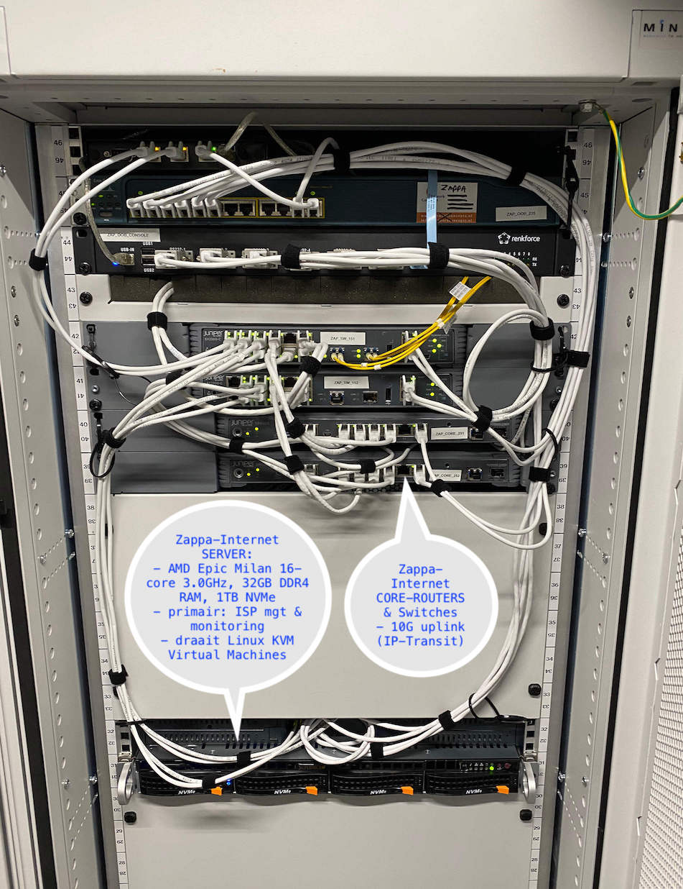
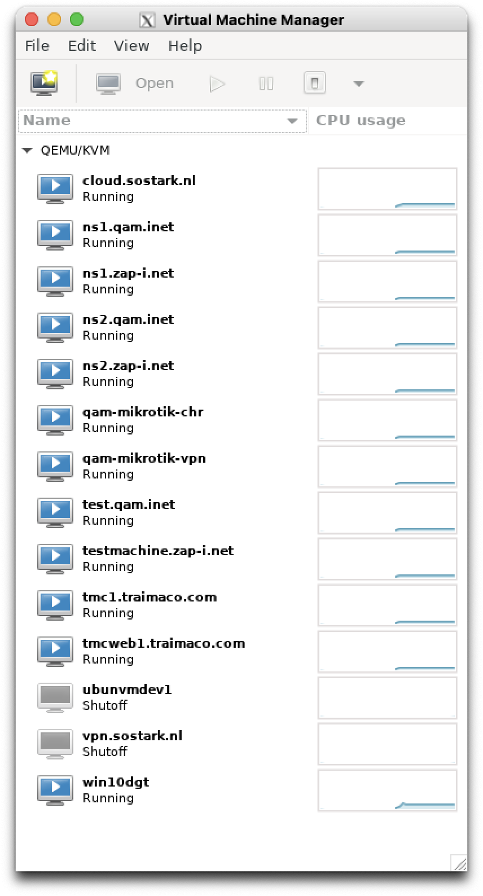
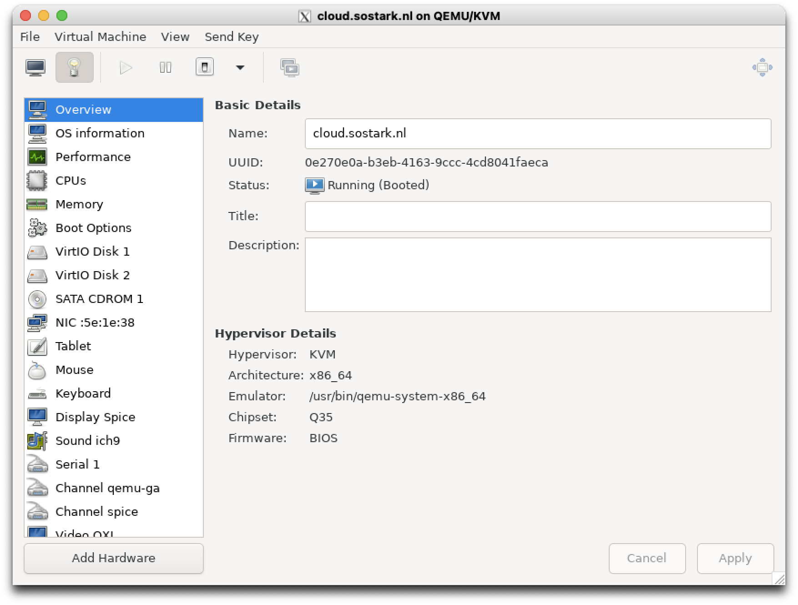
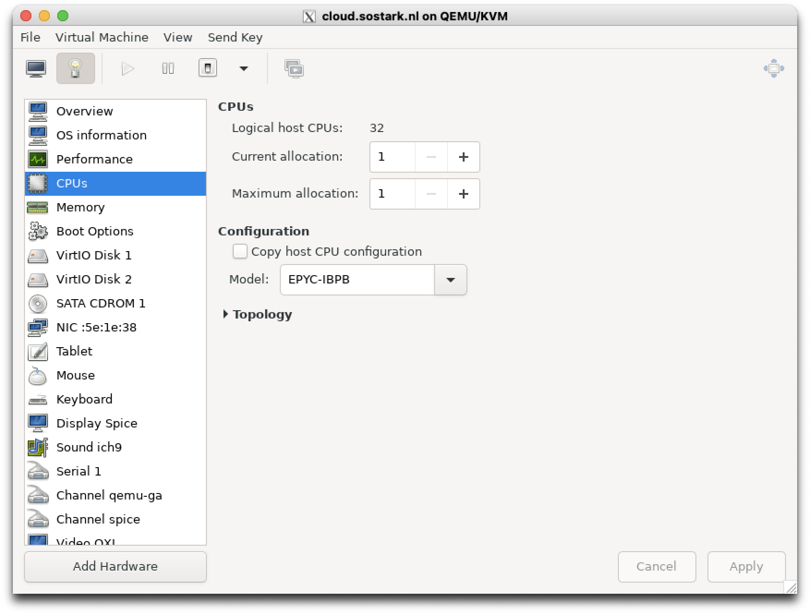
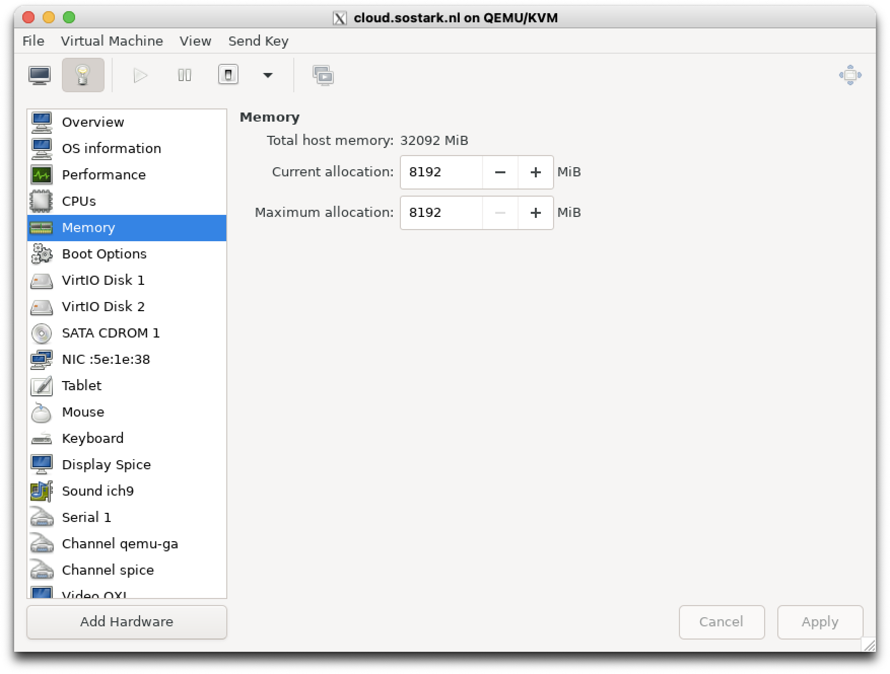
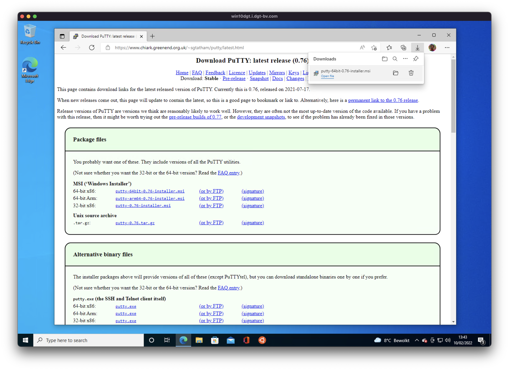
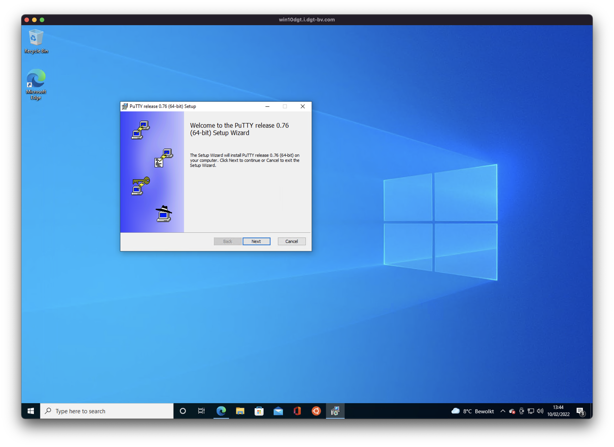
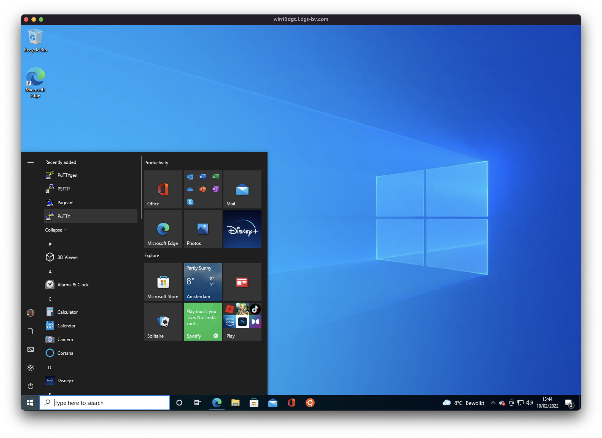
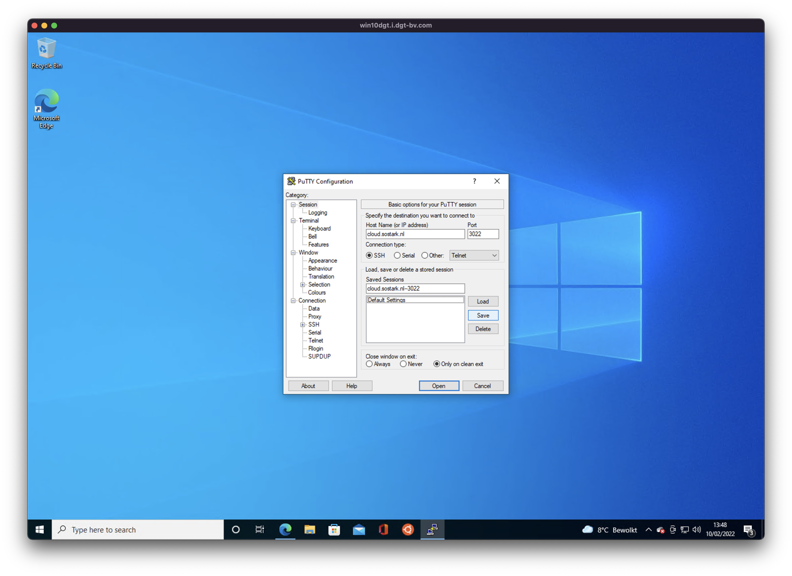

<!-- # 12-deployment.md -->

# Deployment

## Cloud-server (cloud.sostark.nl)

### Physical server

Photo of physical server in rack of provider Zappa-Internet in NIKHEF datacenter Amsterdam:

### Virtual Machine

          

### IP addresses

- cloud.i.sostark.nl = `10.212.21.1` (openvpn-gwserver)
- cloud.sostark.nl = `193.38.153.12` (zappa-isp-internal: `100.91.11.212`)

## Deployment Design

### Deployment following DTAP

The Deployment Design follows the [DTAP](https://en.wikipedia.org/wiki/Development,_testing,_acceptance_and_production) "Phased Environments" approach.

Note: that these environments typically run in parallel !

| Phase Letter | Phase Name             | Description                                                                                                                                                 |
| ------------ | ---------------------- | ----------------------------------------------------------------------------------------------------------------------------------------------------------- |
| `D`          | Development (-testing) | The software runs for testing of code, typically with console-logging enabled, and frequent reloads                                                         |
| `T`          | Testing (integration-) | The software runs for testing of overall functionallity and integration of other parts (client-server, etc.), and is only reloaded after upgrade from env:D |
| `A`          | Acceptance (-testing ) | The software runs for "Acceptance Testing", meaning running (automated) Unit-tests and/or Integration-tests against documented (coded) criteria.            |
| `P`          | Production             | The software is done with (acceptance) testing, and runs in production (meaning customers and/or partners are using this application instance)              |

### Deployment Number Design

The deployment-number is used as a Minor number part in TCP-port numbers.

| Deployment number | Deployment Name      | Description                                              |
| ----------------- | -------------------- | -------------------------------------------------------- |
| `51`              | Cloud-51/Engineering | API-v1 and Dashboard-v1 for Engineering                  |
| `52`              | Cloud-52/Engineering | API-v2.1 and Dashboard-v2.1 for Engineering              |
| `57`              | Cloud-57/WTC-ND      | API-v2.0 and Dashboard-v2.0 for Testing:Sonicbolt/WTC-ND |

### App Number Design

The App-number is used as a Major number part in TCP-port numbers.

| App number | App Name           | Description                                                            |
| ---------- | ------------------ | ---------------------------------------------------------------------- |
| `80`       | node/express       | API-server (for Testing or Production, but not Development)            |
| `81`       | node/mongo-express | Mongo-Express (view/change the MongoDB directly, independently of API) |
| `82`       | node/web/react     | Dashboard                                                              |
| `270`      | mongodb            | MongoDB-server                                                         |

## Jump-page for current Deployments

### Cloud-51

Also called: TokenMe APV-v1 + "old-v1" Dashboard-v1

- Dashboard: https://cloud.sostark.nl/code/63995848/dashboard/
- Dashboard (private, VPN-internal): http://cloud.i.sostark.nl:3300/
- mongodb (Docker Container): tcp/27051
- mongo-express (Docker Container): http://cloud.i.sostark.nl:8151/

### Cloud-52

Also called: TokenMe APV-v2 + "Engineering" Dashboard-v2

- Dashboard: https://cloud52.sostark.nl/code/75114096/dashboard/
- Dashboard (private, VPN-internal): http://cloud.i.sostark.nl:8252/
- API (private, VPN-internal): http://cloud.i.sostark.nl:8052/
- Chat test for Socket.io: http://cloud.i.sostark.nl:8052/api/public/test_1e52/chat.html
- mongodb (Docker Container): tcp/27052
- mongo-express (Docker Container): http://cloud.i.sostark.nl:8152/

### Cloud-57

Also called: Sonicbold/WTC-ND-Test APV-v2 + Dashboard-v2

- Dashboard: https://cloud.sostark.nl/wtc-nd-test/code/39068592/
- WebUI (private, apiserver) http://cloud.i.sostark.nl:8017/
- WebUI (private, webui) http://cloud.i.sostark.nl:8082/
- mongodb (Docker Container): tcp/27057
- mongo-express (Docker Container): http://cloud.i.sostark.nl:8157/

### Github repositories

- code repo the original "main" repo SUM4: https://github.com/Sostark/SUM4   this code has been copied-to and split-in new repos:
  - TokenMe-API-Server
  - TokenMe-Dashboard-Server
  - TokenMe-Wifi-Anchor
- code repo TokenMe-API-Server: https://github.com/Sostark/TokenMe-API-Server
- code repo TokenMe-Dashboard-Server: https://github.com/Sostark/TokenMe-Dashboard-Server
- code repo TokenMe-Wifi-Anchor: https://github.com/Sostark/TokenMe-Wifi-Anchor
- doc repo TokenMe-API: https://github.com/Sostark/TokenMe-API   and doc-page: https://sostark.github.io/TokenMe-API/
- doc repo TokenMe-Architecture: https://github.com/Sostark/TokenMe-Architecture

### Webhook (arch-doc hosting)

- Webhook: https://cloud.sostark.nl/code/29117732/doc/webhook.handle
- Webhook (vpn-internal): http://cloud.i.sostark.nl:9922

## Manual on SSH login

- In order to login to the Cloud-server or an (Linux-based) Anchor, you need SSH access, and in some cases also OpenVPN access.
- There is an OpenVPN server running on the Cloud.server that has 2 networks:
  - 10.212.22.x for (Windows/Mac) clients
  - 10.212.21.x for (Linux-based) Anchors, and other always-on gateways (like in the office of JDG)
- If you need only SSH access, you don't need an OpenVPN connection, as you can use the Cloud-server as a 'Jump-host' (login to server-1, and from server-1 you login to server-2)
- On Mac and Linux systems, the SSH client can be used on the console or CLI (Command Line Interface), but on Windows the CLI (Command Prompt, in this case) does not have a SSH client, so you need to install one.
- on Windows you can download and install Putty SSH-client   download: https://www.chiark.greenend.org.uk/~sgtatham/putty/latest.html
- Below a brief screenshot-based manual on how to use SSH on Windows:
- Download Putty   
- Install Putty   
- Start Putty   
- Start (and save) a session (remember to change the port number, if required)   

## Manual on Serial Anchor testing

- login as user 'tokenme'   (pwd same as WiFi:Sostark_Mobile)   `ssh tokenme@hostname-anchor.sosstark.nl`
- go to folder   `cd prod/TokenMe-Wifi-Anchor/ucon-mgr/`
- stop daemon 'serial_anchor.py' (called via init-script: 'etc/init.d/serial_anchor')   `./stop.sh`
- start minicom (linux replacement of terraterm)   `./minicom-115200-dev-ttyS0.sh`
- run daemon 'serial_anchor.py' directly (instead via init-script) (to see stdout)   `./run.sh`
- start daemon 'serial_anchor.py' (called via init-script: 'etc/init.d/serial_anchor')   `./start.sh`
- dump and follow the text lines in file 'serial-dump.txt'   `./tail-f-serial-dump.sh`

## Manual on Anchor Shutdown

- login as user 'tokenme' on an Anchor   (pwd same as WiFi:Sostark_Mobile)   (need VPN access, sum4-anchor-1 has VPN-IP 10.212.100.81)   `ssh tokenme@10.212.100.81`
- Use this command to reboot   `sudo reboot`
- Use this command to halt / shutdown   `sudo halt`

