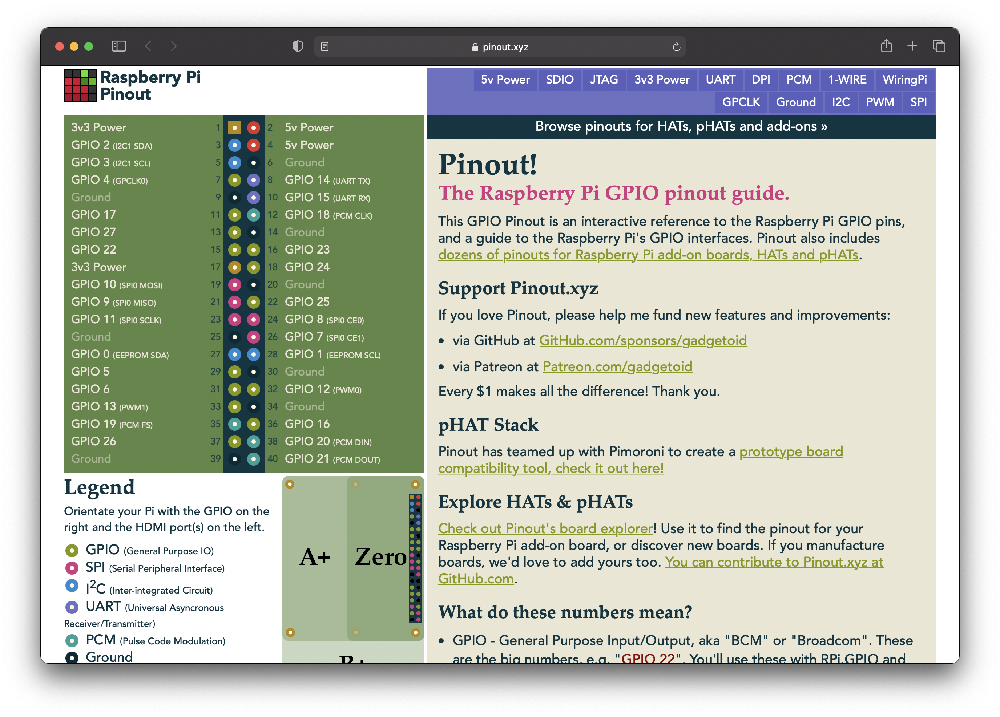
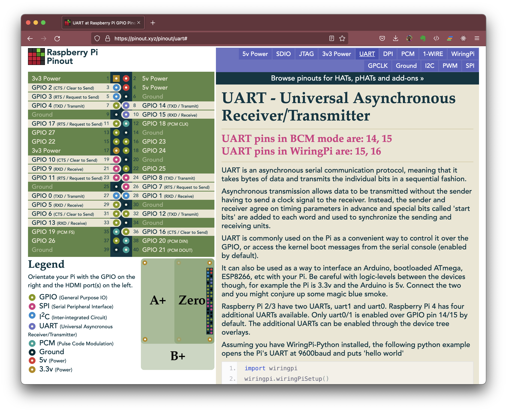

<!-- 80-misc.md -->

# Miscellaneous Tech Topics

## UART in RPI-3/4/Z CPU

- https://datasheets.raspberrypi.com/bcm2835/bcm2835-peripherals.pdf says:
  - "The BCM2835 device has two UARTS. On Mini-UART and a PL011-UART. This section describes the PL011 UART. For details of the mini UART see 2.2 Mini UART."
  - "The PL011 UART is a Universal Asynchronous Receiver/Transmitter. This is the ARM UART (PL011) implementation."
  - "For the in-depth UART overview, please, refer to the ARM PrimeCell UART (PL011) Revision: r1p5 Technical Reference Manual."
- https://www.raspberrypi.com/documentation/computers/processors.html
  - "The BCM2835 is the Broadcom chip used in the Raspberry Pi 1 Models A, A+, B, B+, the Raspberry Pi Zero, the Raspberry Pi Zero W, and the Raspberry Pi Compute Module 1."
  - "The Raspberry Pi RP3A0 is our first System-in-Package (SiP) consisting of a Broadcom BCM2710A1 — which is the silicon die packaged inside the Broadcom BCM2837 chip which is used on the Raspberry Pi 3 along with 512 MB of DRAM. It is used by the Raspberry Pi Zero 2 W."
  - "The underlying architecture of the BCM2837 is identical to the BCM2836."
  - "This is the Broadcom chip used in the Raspberry Pi 4 Model B, the Raspberry Pi 400, and the Raspberry Pi Compute Module 4. The architecture of the BCM2711 is a considerable upgrade on that used by the SoCs in earlier Raspberry Pi models."
- more info:   https://raspberry-projects.com/pi/pi-hardware/bcm2835

| Platforms | SoC | Datasheets |
| -- | -- | -- |
| RPI-1 , RPI-ZW  | BCM2835 | https://datasheets.raspberrypi.com/bcm2835/bcm2835-peripherals.pdf |
| RPI-3 , RPI-Z2W | BCM2837 | https://datasheets.raspberrypi.com/bcm2836/bcm2836-peripherals.pdf |
| RPI-4          | BCM2711 | https://datasheets.raspberrypi.com/bcm2711/bcm2711-peripherals.pdf |

### About the different UARTs

- Mini-UART 
- PL011-UART
  - "PrimeCell® UART (PL011) Revision: r1p5"
  - "The UART is an Advanced Microcontroller Bus Architecture (AMBA) compliant System-on-Chip (SoC) peripheral that is developed, tested, and licensed by ARM."
  - https://developer.arm.com/documentation/ddi0183/g/
  - PDF: https://documentation-service.arm.com/static/5e8e36c2fd977155116a90b5?token=
- https://elinux.org/RPi_Serial_Connection
- https://www.raspberrypi.com/documentation/computers/configuration.html#configuring-uarts 
  - "NOTE FOR RASPBERRY PI 3: The Raspberry pi 3 has changed things around a bit: ttyAMA0 now refers to the serial port that is connected to the bluetooth. The old serial port is now called ttyS0. So if you have an RPI3, everywhere you see "ttyAMA0" below, you should read "ttyS0". The Broadcom UART appears as /dev/ttyAMA0 under Linux. There are several minor things in the way if you want to have dedicated control of the serial port on a Raspberry Pi."

### Raspberry Pi GPIO Pinout

- https://pinout.xyz/
- https://pinout.xyz/pinout/uart#   "Raspberry Pi 2/3 have two UARTs, uart1 and uart0. Raspberry Pi 4 has four additional UARTs available. Only uart0/1 is enabled over GPIO pin 14/15 by default. The additional UARTs can be enabled through the device tree overlays."

~~~bash
> lt /dev/serial*
lrwxrwxrwx 1 root root 7 Feb 11 19:17 /dev/serial1 -> ttyAMA0
lrwxrwxrwx 1 root root 5 Feb 11 19:17 /dev/serial0 -> ttyS0
~~~

~~~bash
> egrep -A6 '^Name:\s+disable-bt' /boot/overlays/README   
Name:   disable-bt
Info:   Disable onboard Bluetooth on Pi 3B, 3B+, 3A+, 4B and Zero W, restoring
        UART0/ttyAMA0 over GPIOs 14 & 15.
        N.B. To disable the systemd service that initialises the modem so it
        doesn't use the UART, use 'sudo systemctl disable hciuart'.
Load:   dtoverlay=disable-bt
Params: <None>
~~~

~~~bash
> cd /etc
> ff hciuart
./systemd/system/multi-user.target.wants/hciuart.service
~~~

~~~bash
> sudo systemctl disable hciuart
Removed /etc/systemd/system/multi-user.target.wants/hciuart.service.
~~~

~~~bash
> echo "dtoverlay=disable-bt" >> /boot/config
~~~

## UART in RPI-Pico uCon

- some

## MCU development

- MCUXpresso IDE   https://www.nxp.com/design/software/development-software/mcuxpresso-software-and-tools-/mcuxpresso-integrated-development-environment-ide:MCUXpresso-IDE

